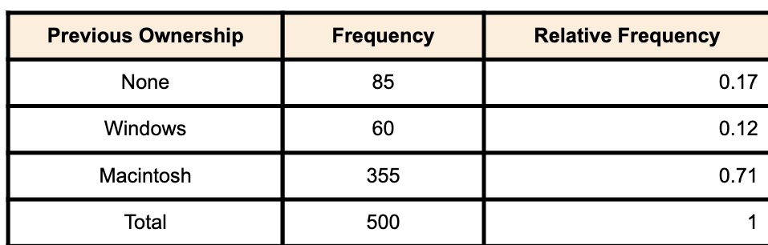
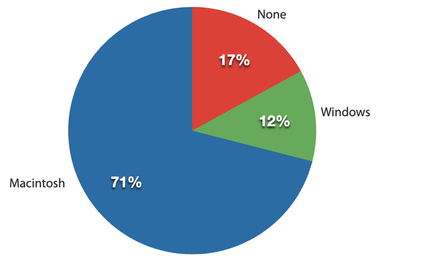
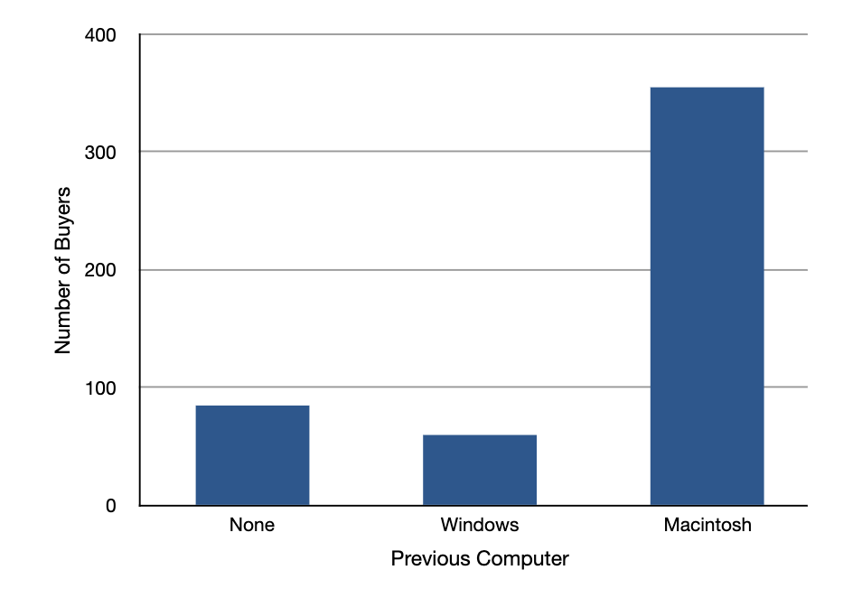
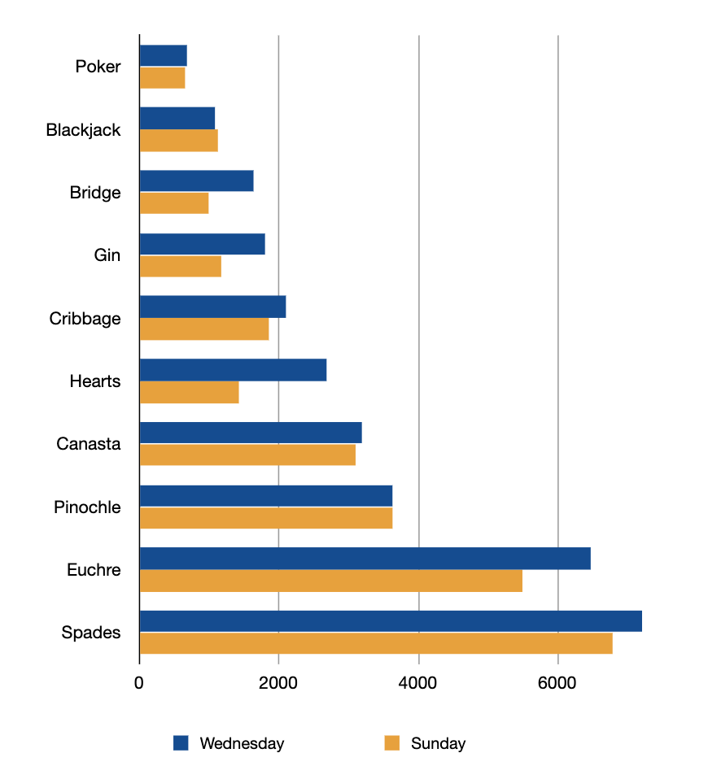

# 2. رسم توزیع ها

الف) متغیرهای کیفی
ب) متغیرهای کمی
- نمودار شاخه و برگ
- هیستوگرام
- فراوانی های چند ضلعی
- نمودار جعبه ای
- نمودار میله ای
- نمودار خطی
- نمودار نقطه ای
ج) تمارین

رسم نمودار ها اولین و در اکثر مواقع مهم ترین گام در تحلیل داده است.در دوران کامپیوتر، محققان اکثر مواقع فقط نتایج تحلیل پیچیده کامپیوتر را فقط می بینند بدون اینکه به خود داده ها نگاهی بیندازند. (یک جمله)
	این فصل در مورد بعضی از انواع کلاسیک نمودارها مانند نمودارهای میله ای که توسط ویلیام پلیفیر در قرن ۱۸ام اختراع شد همچنین نمودار جعبه ای که در قرن ۲۰ ام توسط جان توکی اختراع شد.

## رسم متغیرهای کیفی

*پیش نیازها*
- فصل ۱: متغیرها

*هدف های یادگیری*
1. ساخت جدول فراوانی
2. تشخیص اینکه چه زمانی نمودار دایره ای مفید و چه زمانی مفید نیستند.
3. ساخت و تحلیل نمودار های میله ای
4. شناسایی مشکلات پرتکرار نموداری

زمانی که کامپیوتر اپل به نام کامپیوتر iMac در آگوست سال ۱۹۹۸ معرفی شد، این شرکت میخواست ببیند که آیا iMac باعث گسترش سهم بازار اپل شد یا خیر. ایا iMac داشت فقط کاربران قبلی مکینتاش را جذب می کرد؟ یا توسط افراد جدید خریداری می شد و یا از ویندوز به سمت مکینتاش آمده اند ؟ برای بررسی این موضوع، با ۵۰۰ نفر از خریداران iMac مصاحبه شد و هر مشتری بر اساس اینکه  دارندگان قبلی مکینتاش باشند و یا دارندگان ویندوز بودند و یا اولین خرید کامپیوتر را داشتند بخش بندی شدند.
این بخش به بررسی روش های نموداری برای نمایش نتایج این مصاحبه ها است. ما یک سری درس هایی عمومی راجب چطور نمودار رسم کنیم زمانی که داده های ما در بخش های کوچکی قرار می گیرند. بخش بعدی در نظر می گیریم که چطور داده های عددی رسم کنیم زمانی که هر مشاهده با یک عدد در بازه نمایش داده می شود. نکته مهمی راجب داده های کمی که در این بخش ما را مشغول می کند این است که آنها با ترتیب از قبل بیان شده نمی آیند (طوری که اعداد ترتیب دارند) برای مثال، هیچ روش طبیعی برای بیان اینکه که رسته دارندگان قبلی ویندوز  بعد یا قبل از رسته دارندگان قبلی مکینتاش می آید این وضعیت ممکن است داده های کیفی را محدود کند (اصلاح)، مانند وزن یک فرد.
انسان ها با یک وزن به طور طبیعی مرتب می شوند نسبت به افراد در سایر وزن ها.

### جداول فراوانی
تمام روش های گرافیکی که در این بخش آمده است از جدول فراوانی مشتق گرفته شده است. جدول۱ نشان دهنده جدول فراوانی برای نتایج تحقیق iMac است، نشان دهنده فراوانی های جواب های رسته ای متفاوت است، این جدول همچنین نشان دهنده فراوانی های نسبی نیز هست، که شامل نسبت هر کدام از جواب ها برای هر رسته است. برای مثال فراوانی نسبی برای 'none'  برابر $0.17 = 85/500$.

جدول۱. جدول فراوانی برای داده iMac.

### نمودار دایره ای

نمودار دایره ای در شکل۱ نشان دهنده نتایج تحقیق iMac می باشد در یک نمودار میله ای. هر رسته با یک بخش از دایره نمایش داده می شود. مساخت هر بخش نمودار به نسبت درصد جواب ها در هر رسته است. این به طور ساده فقط جدول فراوانی نسبی ضربدر ۱۰۰ است. با این حال، اکثر خریداران iMac از دارندگان قبلی مکینتاش بودند. ۱۲ درصد خریداران از دارندگان قبلی ویندوز بودند و ۱۷ درصد از خریداران اولین کامپیوتر خودشان را خریده بودند.

شکل۱، نمودار دایره ای خریداران iMac نمایش داده شده با فراوانی دارندگان قبلی کامپیوتر

نمودار های دایره ای برای نمایش فراوانی ها نسبی در تعداد رسته های کم بسیار پرکاربرد هستند. اما آنها پیشنهاد نمی شوند با اینحال برای زمانی که تعداد زیادی رسته دارید. نمودار های دایره ای می توانند گیج کننده باشند زمانی که بخواهیم نتایج دو پرسشنامه یا آزمایش را باهم مقایسه کنیم.در یک کتاب بسیار تاثیر گذار برای استفاده از نمودارها. ادوارد توفت گفتند: تنها طراحی بدتر از نمودارهای دایره ای استفاده از چندتا از آنهاست.
	یک نکته مهم دیگر راجب نمودار های دایره ای این است که اگر بر اساس تعداد کمی از مشاهدات باشند، می تواند نادرست باشد اینکه بخش های دایره را با درصد نمایش دهیم برای مثال، اگر فقط ۵ نفر برای کامپیوتر های اپل مصاحبه شده بودند و ۳ نفر از کاربران ویندوز بودند درصد آن بخش به ۶۰ درصد می رسید که گمراه کننده بود. با مصاحبه افراد کم، این درصد های زیاد امکان رخ دادن داشتند به دلیل اینکه شانس می تواند خطاهای بزرگی در نمونه های کوچک داشته باشد. در این وضع، باید  از عدد استفاده شده برای ساخت نمودار دایره ای برای گمراه نکردن کاربران استفاده کنیم. این بخش ها باید پس بر اساس فراوانی های مشاهده شده ارائه شود به جای درصد.

### نمودار میله ای
نمودارهای میله ای میتواند استفاده شوند در نشان دادن فراوانی ها در رسته های مختلف. یک نمودار میله ای از خریدهای iMac در شکل۲ نشان داده شده است. فراوانی های در محور Y و نوع کامپیوتر قبلی در محور X ها نشان داده می شود. به طور واضح، محور Y نشان دهنده تعداد مشاهدات در هر رسته است تا اینکه درصد هر مشاهده در هر رسته که در نمودار دایره ای استفاده می شود.

شکل۲. نمودار میله ای خریداران iMac با توجه به دارندگان کامپیوترها

#### مقایسه توزیع ها
اکثر اوقات ما نیاز داریم که نتایج پرسشنامه های متفاوت را با هم مقایسه کنیم یا شرایط مختلفی که در پرسشنامه وجود دارد، در این جا، ما داریم "توزیع های" جواب های بین پرسشنامه و شرایط را مقایسه می کنیم. نمودارهای میله ای اکثر اوقات برای نمایش تفاوت بین دو توزیع عالی هستند. شکل۳ نشان دهنده تعداد افرادی است که کارت بازی می کنند در وبسایت یاهو در شنبه و در چهارشنبه در فصل بهار سال ۲۰۰۱. ما دیدیم که به طور کلی در چهارشنبه در مقایسه با شنبه بیشتر افراد بازی می کنند.تعداد کسانی که pinochle بازی می کنند فرقی در این دو روز ندارد با این تفاوت که، تعداد افرادی که hearts بازی می کنند دو برابر است که در چهارشنبه بازی می کنند تا اینکه در شنبه بازی کنند. حقیقت های مانند این به طور واضح از نمودار های میله خوب طراحی شده بدست می آید.

شکل۳. یک نمودار میله ای از تعداد افرادی که بازی های کارت متفاوت در شنبه و چهارشنبه بازی می کنند.

میله ها در شکل۳ به شکل افقی نمایش داده شده است تا عمودی. فرمت افقی به کار می آید زمانی که رسته های زیادی دارید به دلیل اینکه فضای بیشتری برای لیبل ها رسته است.  ما نمودارهای بیشتری داریم زمانی که ما می خواهیم کمیت های عددی را بیان کنیم.