# 2. رسم توزیع ها

الف) متغیرهای کیفی
ب) متغیرهای کمی
- نمودار شاخه و برگ
- هیستوگرام
- فراوانی های چند ضلعی
- نمودار جعبه ای
- نمودار میله ای
- نمودار خطی
- نمودار نقطه ای
ج) تمارین

رسم نمودار ها اولین و در اکثر مواقع مهم ترین گام در تحلیل داده است.در دوران کامپیوتر، محققان اکثر مواقع فقط نتایج تحلیل پیچیده کامپیوتر را فقط می بینند بدون اینکه به خود داده ها نگاهی بیندازند. (یک جمله)
	این فصل در مورد بعضی از انواع کلاسیک نمودارها مانند نمودارهای میله ای که توسط ویلیام پلیفیر در قرن ۱۸ام اختراع شد همچنین نمودار جعبه ای که در قرن ۲۰ ام توسط جان توکی اختراع شد.

## رسم متغیرهای کیفی

*پیش نیازها*
- فصل ۱: متغیرها

*هدف های یادگیری*
1. ساخت جدول فراوانی
2. تشخیص اینکه چه زمانی نمودار دایره ای مفید و چه زمانی مفید نیستند.
3. ساخت و تحلیل نمودار های میله ای
4. شناسایی مشکلات پرتکرار نموداری

زمانی که کامپیوتر اپل به نام کامپیوتر iMac در آگوست سال ۱۹۹۸ معرفی شد، این شرکت میخواست ببیند که آیا iMac باعث گسترش سهم بازار اپل شد یا خیر. ایا iMac داشت فقط کاربران قبلی مکینتاش را جذب می کرد؟ یا توسط افراد جدید خریداری می شد و یا از ویندوز به سمت مکینتاش آمده اند ؟ برای بررسی این موضوع، با ۵۰۰ نفر از خریداران iMac مصاحبه شد و هر مشتری بر اساس اینکه  دارندگان قبلی مکینتاش باشند و یا دارندگان ویندوز بودند و یا اولین خرید کامپیوتر را داشتند بخش بندی شدند.
این بخش به بررسی روش های نموداری برای نمایش نتایج این مصاحبه ها است. ما یک سری درس هایی عمومی راجب چطور نمودار رسم کنیم زمانی که داده های ما در بخش های کوچکی قرار می گیرند. بخش بعدی در نظر می گیریم که چطور داده های عددی رسم کنیم زمانی که هر مشاهده با یک عدد در بازه نمایش داده می شود. نکته مهمی راجب داده های کمی که در این بخش ما را مشغول می کند این است که آنها با ترتیب از قبل بیان شده نمی آیند (طوری که اعداد ترتیب دارند) برای مثال، هیچ روش طبیعی برای بیان اینکه که رسته دارندگان قبلی ویندوز  بعد یا قبل از رسته دارندگان قبلی مکینتاش می آید این وضعیت ممکن است داده های کیفی را محدود کند (اصلاح)، مانند وزن یک فرد.
انسان ها با یک وزن به طور طبیعی مرتب می شوند نسبت به افراد در سایر وزن ها.

### جداول فراوانی
تمام روش های گرافیکی که در این بخش آمده است از جدول فراوانی مشتق گرفته شده است. جدول۱ نشان دهنده جدول فراوانی برای نتایج تحقیق iMac است، نشان دهنده فراوانی های جواب های رسته ای متفاوت است، این جدول همچنین نشان دهنده فراوانی های نسبی نیز هست، که شامل نسبت هر کدام از جواب ها برای هر رسته است. برای مثال فراوانی نسبی برای 'none'  برابر $0.17 = 85/500$.

جدول۱. جدول فراوانی برای داده iMac.

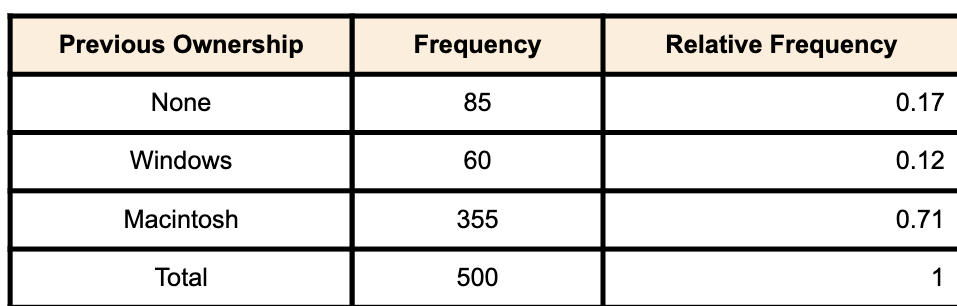

### نمودار دایره ای

نمودار دایره ای در شکل۱ نشان دهنده نتایج تحقیق iMac می باشد در یک نمودار میله ای. هر رسته با یک بخش از دایره نمایش داده می شود. مساخت هر بخش نمودار به نسبت درصد جواب ها در هر رسته است. این به طور ساده فقط جدول فراوانی نسبی ضربدر ۱۰۰ است. با این حال، اکثر خریداران iMac از دارندگان قبلی مکینتاش بودند. ۱۲ درصد خریداران از دارندگان قبلی ویندوز بودند و ۱۷ درصد از خریداران اولین کامپیوتر خودشان را خریده بودند.

شکل۱، نمودار دایره ای خریداران iMac نمایش داده شده با فراوانی دارندگان قبلی کامپیوتر

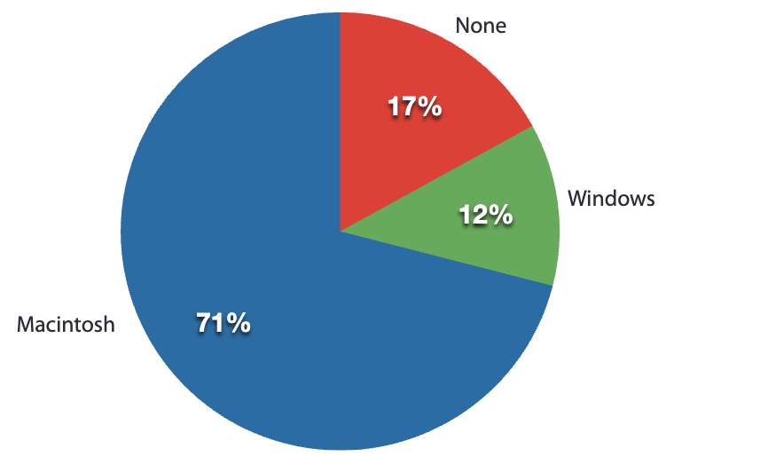

نمودار های دایره ای برای نمایش فراوانی ها نسبی در تعداد رسته های کم بسیار پرکاربرد هستند. اما آنها پیشنهاد نمی شوند با اینحال برای زمانی که تعداد زیادی رسته دارید. نمودار های دایره ای می توانند گیج کننده باشند زمانی که بخواهیم نتایج دو پرسشنامه یا آزمایش را باهم مقایسه کنیم.در یک کتاب بسیار تاثیر گذار برای استفاده از نمودارها. ادوارد توفت گفتند: تنها طراحی بدتر از نمودارهای دایره ای استفاده از چندتا از آنهاست.
	یک نکته مهم دیگر راجب نمودار های دایره ای این است که اگر بر اساس تعداد کمی از مشاهدات باشند، می تواند نادرست باشد اینکه بخش های دایره را با درصد نمایش دهیم برای مثال، اگر فقط ۵ نفر برای کامپیوتر های اپل مصاحبه شده بودند و ۳ نفر از کاربران ویندوز بودند درصد آن بخش به ۶۰ درصد می رسید که گمراه کننده بود. با مصاحبه افراد کم، این درصد های زیاد امکان رخ دادن داشتند به دلیل اینکه شانس می تواند خطاهای بزرگی در نمونه های کوچک داشته باشد. در این وضع، باید  از عدد استفاده شده برای ساخت نمودار دایره ای برای گمراه نکردن کاربران استفاده کنیم. این بخش ها باید پس بر اساس فراوانی های مشاهده شده ارائه شود به جای درصد.

### نمودار میله ای
نمودارهای میله ای میتواند استفاده شوند در نشان دادن فراوانی ها در رسته های مختلف. یک نمودار میله ای از خریدهای iMac در شکل۲ نشان داده شده است. فراوانی های در محور Y و نوع کامپیوتر قبلی در محور X ها نشان داده می شود. به طور واضح، محور Y نشان دهنده تعداد مشاهدات در هر رسته است تا اینکه درصد هر مشاهده در هر رسته که در نمودار دایره ای استفاده می شود.

شکل۲. نمودار میله ای خریداران iMac با توجه به دارندگان کامپیوترها

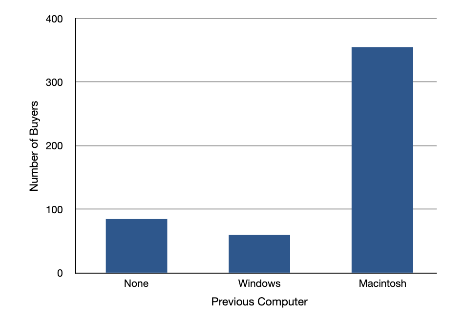

#### مقایسه توزیع ها
اکثر اوقات ما نیاز داریم که نتایج پرسشنامه های متفاوت را با هم مقایسه کنیم یا شرایط مختلفی که در پرسشنامه وجود دارد، در این جا، ما داریم "توزیع های" جواب های بین پرسشنامه و شرایط را مقایسه می کنیم. نمودارهای میله ای اکثر اوقات برای نمایش تفاوت بین دو توزیع عالی هستند. شکل۳ نشان دهنده تعداد افرادی است که کارت بازی می کنند در وبسایت یاهو در شنبه و در چهارشنبه در فصل بهار سال ۲۰۰۱. ما دیدیم که به طور کلی در چهارشنبه در مقایسه با شنبه بیشتر افراد بازی می کنند.تعداد کسانی که pinochle بازی می کنند فرقی در این دو روز ندارد با این تفاوت که، تعداد افرادی که hearts بازی می کنند دو برابر است که در چهارشنبه بازی می کنند تا اینکه در شنبه بازی کنند. حقیقت های مانند این به طور واضح از نمودار های میله خوب طراحی شده بدست می آید.

شکل۳. یک نمودار میله ای از تعداد افرادی که بازی های کارت متفاوت در شنبه و چهارشنبه بازی می کنند.

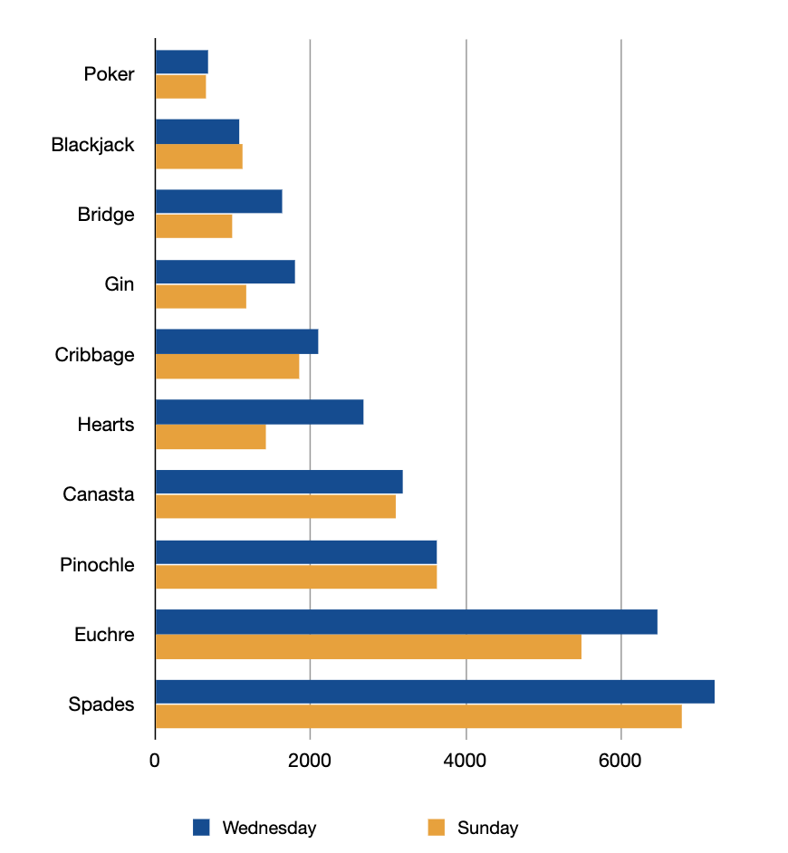

میله ها در شکل۳ به شکل افقی نمایش داده شده است تا عمودی. فرمت افقی به کار می آید زمانی که رسته های زیادی دارید به دلیل اینکه فضای بیشتری برای لیبل ها رسته است.  ما نمودارهای بیشتری داریم زمانی که ما می خواهیم کمیت های عددی را بیان کنیم.

#### مشکلات گرافیکی که باید از آنها دوری کنیم.

دنبال کارها پر زرق و برق نباشید. مردم بعضی اوقات یک سری متغیر به نمودار ها اضافه می کنند که کمک کننده بیان اطلاعات نمی باشد. برای مثال ، یک نمودار میله ای ۳ بعدی مانند شکل ۴ اکثر اوقات مانند نمودار های میله ای دو بعدی کمک کننده نیستند.

شکل۴، نسخه سه بعدی شکل۲

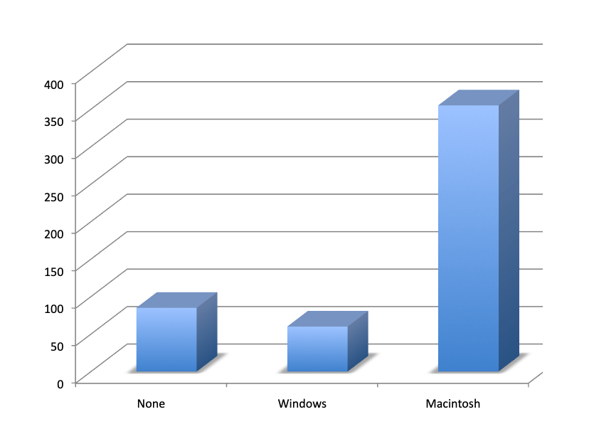

اینحا یک روش پر زرق و برق دیگه ای که باعث مشکل می شود. به جای استفاده از میله های ساده، شاید دلتون بخواهد که از عکس های معنی دار استفاده کنید. برای مثال، شکل۵ نشان دهنده داده ها با عکس های کامپیوتر های iMac است. ارتفاع عکس ها نشان دهنده درستی از تعداد خریداران است. با اینحال شکل ۵ گمراه کننده است به دلیل اینکه توجه بیننده جذب مساحت آنها می شود. مساحت می تواند تفاوت واقعی آنها بین گروه ها را اغراق آمیز کند. در بیان درصدی، نسبت دارندگان مکینتاش به دارندگان ویندوز در اینجا ۶ به ۱ است. اما نسبت مساحت این دو در شکل۵ به ۳۵ به ۱ می رسد. یک فرد با ذهنیت اریب برای پنهان کردن اینکه بسیاری از دارندگان ویندوز از iMac استفاده کردند شاید بخواهد از شکل۵ استفاده کند تا شکل۲.
ادوار توفت به این یک نام 'فاکتور دروغ' داد برای اشاره به این موضوع که  اندازه تاثیر نشان داده شده در این نمودار نسبت به اندازه تاثیر آن در دیتا با هم تناقض دارد، او پیشنهاد کرد که فاکتور دروغ بیشتر از ۱.۰۵ یا کمتر از ۰.۹۵ یک تحریف غیرقابل قبول ایجاد می کند.

شکل۵. یک باز طراحی شکل ۲ با فاکتور دروغ بیشتر از ۸

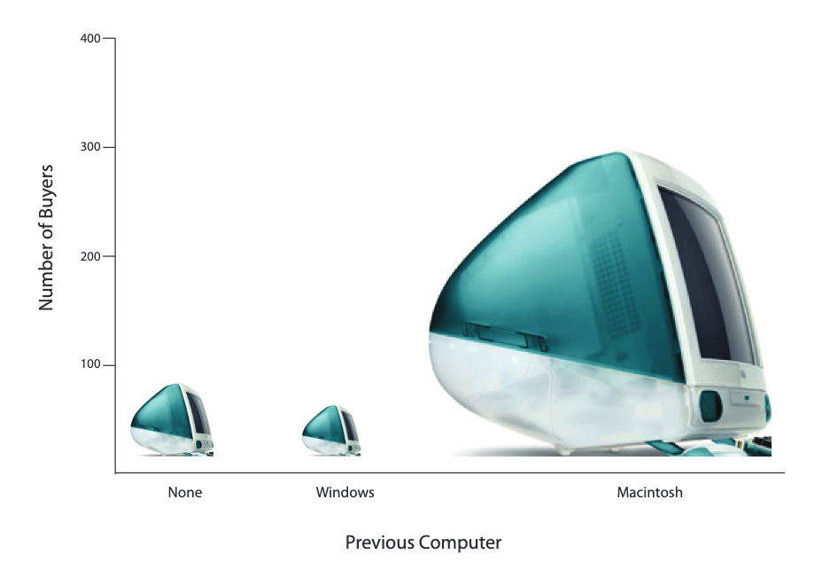

یک تحریف دیگر در نمودار های میله ای این است که مقدار اولیه را به عددی غیر صفر بگذاریم. عدد اولیه پایین محور Y است، که نشان دهنده کمترین عدد ممکن برای هر رسته است. به طور طبیعی، ولی نه همیشه، این عدد باید صفر باشد، شکل۶ نشان دهنده داده iMac با مقدار اولیه ۵۰ است، یک بار دیگر، تفاوت ها بین این مساحت ها یک داستان دیگری را می گویید تا تفاوت واقعی بین درصدها. تعداد کسانی که از ویندوز به مکینتاش آمدند به نظر بسیار کم میاید در مقایسه با مقدار اصلی آن که ۱۲ درصد است.

شکل۶. یک طراحی دوباره از شکل ۲ 

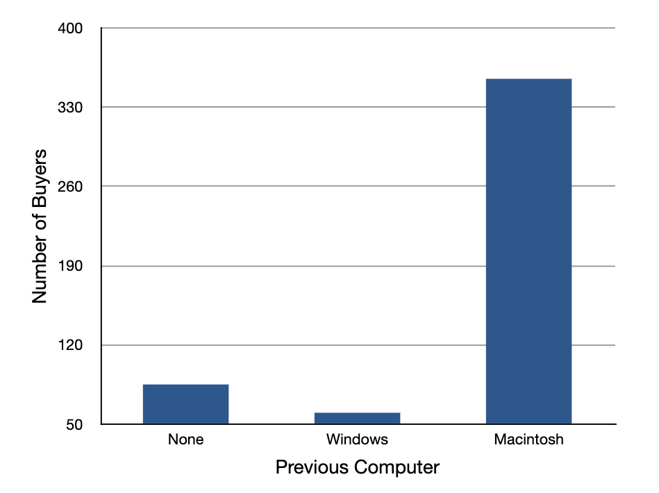

در اخر، یک نکته ای که باید به آن توجه کنیم یک مشکل جدی در استفاده از نمودار خطی است. زمانی که محور X دارای متغیر کیفی است. یک نمودار خطی به طور کلی یک نمودار میله ای با در نظر گرفتن اینکه بالای آن میله ها با نقطه بهم وصل شده است. (بقیه میله از بین رفته است). شکل ۷ به طور نامناسبی نشان دهنده نمودار خطی از داده های بازی کارت از یاهو است. نکته منفی در شکل ۷ این است که ذهنیت اشتباه این را می دهد که این بازی ها به طور طبیعی مرتب شده است به روش عددی. در واقع آنها به صورت الفبا مرتب شده است.

شکل ۷. یک نمودار خطی که به طور خوب تعداد کسانی که در شنبه و چهارشنبه بازی می کنند را نشان نمی دهد.

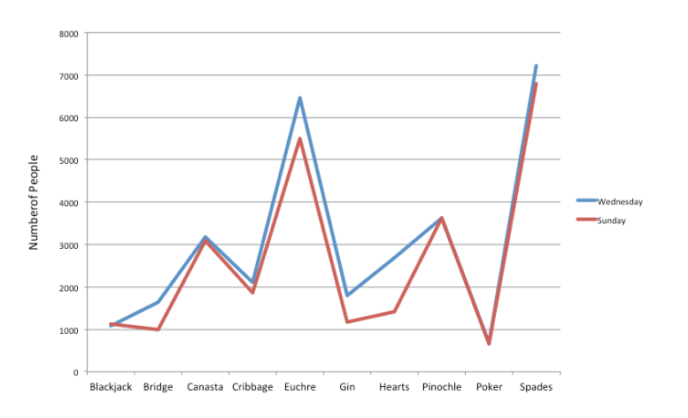

#### خلاصه
نمودارهای دایره ای و نمودارهای میله ای می توانند هر دو روش های مفیدی  برای نشان دادن داده های کیفی هستند. نمودارهای میله ای وقتی بهتر هستند که بیشتر از چند رسته و یا برای مقایسه دو یا چند توزیع استفاده می شود. مراقب باشید که از ساختن نمودارهای گمراه کننده جلوگیری کنید.

## رسم متغیرهای کمی

1. نمایش شاخه و برگ
2. هیستوگرام
3. فراوانی های چند ضلعی 
4. نمودار جعبه ای
5. نمودار میله ای
6. نمودار خطی
7. نمودار نقطه ای

همانطور که در بخش قبل گفته شد که راجب متغیرها در فصل ۱،دمتغیرهای کمی، متغیرهایی هستند که در چارچوب عددی اندازه گیری می شود. قد، وزن، زمان جواب، اندازه درد که به صورت فردی هست، دما و نمره گرفته شده در امتحان همشون مثال هایی از متغیر کمی است، متغیرهای کمی از متغیرهای رسته ای (بعضی وقتا با نام کیفی) متغیرهایی مانند رنگ مورد علاقه، مذهب، شهر تولد ، ورزش مورد علاقه که هیچ ترتیبی در آنها وجود ندارد یا هیچ اندازه گیری وجود ندارد.
	انواع مختلفی از نمودارها وجود دارد که می تواند توزیع های متغیرهای کمی را نشان دهد. بخش های بعدی نمودارها زیر را در بر خواهد داشت: ۱) نمایش شاخه و برگ، ۲) هیستوگرام ۳) چندضلعی فراوانی، ۴) نمودارهای جعبه ای ۵) نمودار میله ای ۶) نمودارهای خطی ۷) نمودارهای نقطه ای و ۸) نمودارهای پراکنش. (توضیح داده شده در یک فصل دیگر). بعضی از نمودارها مانند نمایش شاخه و برگ بهترین روش برای داده های کوچک تا متوسط هستند، اما بقیه نمودارها مانند هیستوگرام برای مقدار بزرگی از داده ها استفاده می شود، نمودارهایی مانند نمودار جعبه ای برای مشخص کردن تفاوت بین توزیع ها استفاده می شوند. نمودارهای پراکنش برای نمایش رابطه بین دو متغیر استفاده می شود.

## نمایش شاخه و برگ

*پیش نیازها*
- فصل ۱: توزیع ها

*هدف های یادگیری*
1. ساخت و توضیح نمایش شاخه و برگ ساده
2. ساخت و توضیح نمایش شاخه و برگ پشت به پشت
3. قضاوت اینکه یک نمایش شاخه و برگ میتواند برای یک دیتاست مناسب باشد

یک نمایش شاخه و برگ می تواند یک روش گرافیکی برای نمایش داده ها باشد. این روش مورد استفاده قرار می گیرد زمانی که دیتای شما بسیار بزرگ نیست. در این بخش، ما توضیح می دهیم که چطور این نمودار ها را رسم و توضیح دهیم.
	مانند همیشه، با یک مثال شروع می کنیم. جدول ۱ را در نظر بگیرید که نشان دهنده تعداد پاس های تاچ داون هست (پاس هایTD) که توسط ۳۱ تیم در ۲۰۰۰ فصل NFL پرتاب شده است.

جدول۱. تعداد پاس های تاچ داون

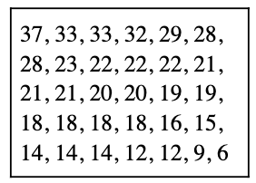

یک نمایش شاخه و برگ این دیتا در شکل ۱ نمایش داده شده است، بخش چپ این شکل۱ شامل شاخه ها است. آنها اعداد ۳،۲،۱ و ۰ هستند، که به صورت یک ستون در سمت چپ میله ها تنظیم شده است. این اعداد را به صورت ۱۰ تایی ببینید، یک شاخه ۳ برای مثال، می تواند استفاده شود تا یک ده تایی را نشان دهد که می تواند هر عددی از ۳۰ تا ۳۹ باشد. اعداد در سمت راست میله برگ ها هستند، و آنها نشان دهنده اعداد یکی هستند. هر برگ در این نمودار نشان دهنده نتیجه جمع ۱۰ برابر برگ به علاوه شاخه مورد نظر آن است.

شکل۲. نمایش شاخه و برگ که شاخه های آن به دو بخش تبدیل می شود

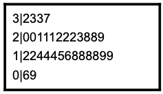

برای واضح تر شدن، بیایم شکل ۱ را دقیق تر بررسی کنیم، در سطر بالا، برگ های سمت راست شاخه ۳ برابر ۲،۳،۳ و ۷ هست. ترکیب شده با شاخه ها این برگ ها نشان دهنده اعداد ۳۲، ۳۳، ۳۳ و ۳۷ هست، که تعداد پاس های TD برای چهار تیم اول جدول ۱ است. سطر بعدی نشان دهنده شاخه ۲ است و ۱۲ برگ است، این دو باهم نشان دهنده ۱۲ دیتا هستند، با این حال، دو تکرار از ۲۰ پاس TD، یک تکرار از ۲۳ پاس TD,  سه تکرار از ۲۲ پاس TD ، دو تکرار از ۲۸ پاس TD و یک تکرار از ۲۹ پاس TD. به عهده شما می گذاریم تا متوجه شوید که سطر سوم نشان دهنده چه چیزی است. سطر چهارم شاخه آن برابر ۰ است و دو برگ دارد. که نشان دهنده دو ورودی در جدول ۱ است. که ۹ پاس TD و ۶ پاس TD است. (این دو عدد ممکن است به شکل ۰۹ و ۰۶ نیز نشان داده شوند)
یک هدف از نمایش شاخه و برگ این است که شکل توزیع را واضح کند. شما می توانید حقیقت هایی را راجب پاس های TD به صورت راحت تر در شکل ۱ ببینید تا در جدول ۱. برای مثال، با نگاه کردن به شاخه و شکل نمودار، می توانید بگویید که بیشتر تیم ها بین ۱۰ تا ۲۹ پاس TD داشته اند، که تعدادی از آنها کمتر و تعدادی از آنها بیشتر بودند، عدد دقیق هر پاس TD می تواند در برگ ها تحلیل شود.
ما می توانیم حقیقت های بیشتری را با تقسیم هر شاخه به دو بخش بدست آوریم. شکل ۲ نشان می دهد که چطور می توان این کار را کرد. سطر بالا برای اعداد ۳۵ تا ۳۹ گذاشته می شود و که فقط جای ۳۷ پاس TD است که توسط تیم اول در جدول ۱ وجود داشته است. سطر دوم برای برای اعداد ۳۰ تا ۳۴ است که دارای ۳۲ ، ۳۳ و ۳۳ پاس TD است که توسط سه تیم بعدی در این جدول انجام شده است. شما می توانید ببینید که بقیه سطرها نشان دهنده چه چیزی است.

شکل۲ . نمایش شاخه و برگ با تقسیم شاخه ها بر دو
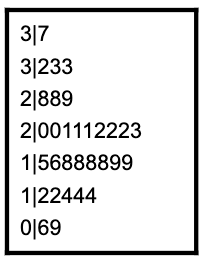

شکل۲ اطلاعات بیشتری نسبت به شکل۱ به ما می دهد به دلیل اینکه شکل۱ مقادیر بسیاری را درون یک ردیف قرار می دهد. اگر می خواهید که شاخه ها را تقسیم کنید به فرم داده های شما بر می گردد. اگر ردیف ها با یک شاخه طولانی باشند، شاید بخواهید که آنها را به دو بخش یا بیشتر تقسیم کنید.
یک شکلی از نمایش شاخه و برگ وجود دارد که برای مقایسه توزیع ها به کار می آید. این دو توزیع ها به صورت پشت به پشت در کنار یک ستون از شاخه ها قرار می گیرد. نتیجه یک نمودار شاخه و برگ پشت به پشت است. شکل۳ همچین نموداری را نشان می دهد. این نمودار تعداد پاس های TD را در فصلهای ۱۹۹۸ و ۲۰۰۰ مقایسه می کند. شاخه ها در وسط قرار دارند، برگ ها در سمت چپ برای داده های سال ۱۹۹۸ و برگ های در سمت راست برای داده سال ۲۰۰۰ است. برای مثال، سطر دو تا مانده به آخری نشان دهنده این است که در سال ۱۹۹۸ تیم هایی با ۱۱، ۱۲ و ۱۳ پاس TD وجود داشتند. و در سال ۲۰۰۰ دو تیم با ۱۲ و سه تیم با ۱۴ پاس TD حضور داشتند.

شکل۳. نمایش شاخه و برگ پشت به پشت. سمت چپ نشان دهنده داده سال ۱۹۹۸ و سمت راست نشان دهنده داده های سال ۲۰۰۰ است.

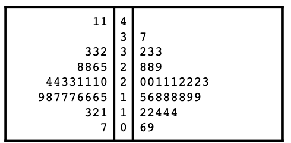

شکل۳ به ما کمک می کند که متوجه شویم که دو فصل ها مانند هم بودند، اما فقط در سال ۱۹۹۸ هر کدام از تیم ها بیشتر از ۴۰ پاس TD داشتند.
دو چیز راجب دیتای فوتبال آمریکایی نمایش ما را با شاخه و برگ آسان می کند. اولا، داده ها محدود شده اند به اعداد صحیح که می توانند با یک رقم شاخه و یک رقم برگ آن را نمایش داد. دوما، تمام اعداد مثبت هستند. اگر داده ما شامل عددی باشد که سه یا بیشتر رقم داشته باشد یا دارای اعشار باشد، آن ها می توانند به دقت دو رقمی برسند. مقادیر منفی به سادگی کنترل می شوند. بیایید تا به یک مثال دیگر نگاه بندازیم.
جدول۲ نشان دهنده داده از تحقیق سلاح و خشونت هست. هر مقدار تفاوت میانگین براساس تکرارهای مکرر است و زمانی که طول کشید تا هر شخص یک کلمه را خشونت آمیز بداند مانند مشت، بر پایه دو شرط، شرط اول، که آن کلمه قبل از یک کلمه غیر از سلاح آمده باشد مانند حشره. در شرط دوم، همان کلمات بعد از کلماتی که سلاح هستند مانند تفنگ یا چاقو آمد، مسئله که قرار بود با این آزمایش حل شود این بود که آیا کلمه قبلی سلاح باشد آیا در تشخیص اینکه یک کلمه خشونت آمیز زودتر انجام می شود نسبت به زمانی که کلمه غیرسلاح استفاده شود. تفاوت های منفی نشان دهنده این هستند که سرعت تشخیص در کلماتی که سلاح داشتند کمتر از کلمات خنثی بود.

جدول۲. تاثیر تشخیص (در هزارم ثانیه)
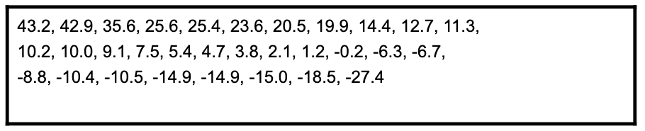

همانطور که می بینید اعداد از ۴۳.۲ تا -۲۷.۴ دامنه دارند. اولین مقدار نشان دهنده این است که یک نمونه ۴۳.۲ میلی ثانیه سریعتر کلمات خشونت آمیز را خواند زمانی که قبل آن کلمات سلاح مانند داشت تا زمانی که کلمات خنثی قبل آن بود. مقدار ۰۲۷.۴ نشان دهنده آن است که یک نمونه دیگر ۲۷.۴ میلی ثانیه کندتر کلمات خشونت آمیز را خواند زمانی که قبل آن کلمات سلاح وجود داشت.
این داده ها با شاخه و برگ در شکل ۴ نمایش داده می شود. به دلیل اینکه نمایش شاخه و برگ می تواند فقط دو رقم را نشان دهد. (یکی برای شاخه و دیگری برای برگ) اعداد اول تقریب زده می شوند، به همین دلیل مقدار ۴۳.۲ تبدیل به ۴۳ می شود و با شاخه ۴ و برگ ۳ نمایش داده می شود. به همین شکل، عدد ۴۲.۹ نیز به ۴۲ تبدیل زده می شود. برای نمایش اعداد منفی، ما به طور ساده از شاخه منفی استفاده می کنیم، برای مثال، سطر پایین شکل نشان دهنده عدد ۰۲۷ است، سطر دو تا مانده به آخری نشان دهنده اعداد ۰۱۰، ۰۱۰ و -۱۵ و ... است. دوباره، ما مقادیر اصلی را تقریب زدیم از جدول دوم.

شکل۴. نمایش شاخه و برگ برای اعداد منفی و با تفریب
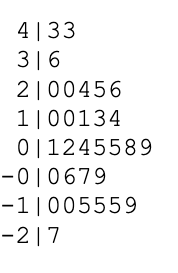

توجه کنید که این شکل دارای یک سطر که با '0' شروع می شود و یک سطر دیگر که با "-0" شروع می شود، شاخه 0  نماینده اعداد بین 0 تا 9 است اما -0 اعداد 0 تا -9 را شامل می شود. برای مثال. سطر پنچم جدول اعداد 1,2,4,5,5,8,9 را شامل می شودو سطر ششم شامل 0 , -6, -7 و -9 را شامل می شود.مقادیری که دقیقا صفر هستند قبل از تقریب زدن باید آن ها را به صورت مساوی بین 0 و -0 تقسیم کنیم. در جدول ۲ هیچکدام از مقادیر قبل از تقریب زدن صفر نیستند. '0' ای که در -0 هست از مقدار اصلی -0.2 میاید.
با اینحال نمایش های شاخه و برگ برای دیتاست های بزرگ است. انها اغلب اوقات برای دیتاست هایی که به 200 مشاهده می رسند نیز به کار می آیند. شکل ۵ نشان دهنده توزیع جمعیت از 185 شهر در سال 1998 است. برای اینکه آن شهر در دیتاست قرار بگیرد شرط آن این بود که باید جمعیت آن شهر بین 100000 تا 500000 نفر باشد.

شکل ۵. نمایش شاخه و برگ از 185 جمعیت شهرهای آمریکا با جمعیت 100000 تا 500000 در سال 1998.

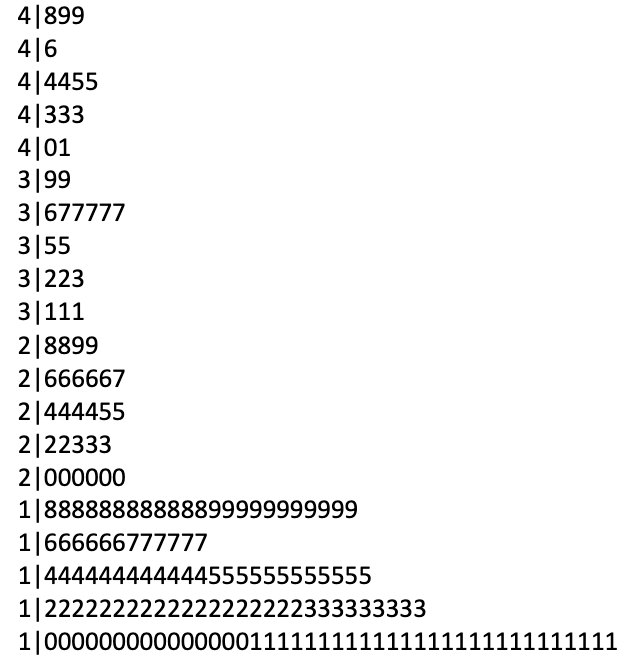

از آنجایی که نمودار شاخه و برگ نشان دهنده فقط دقت دو رقمی است، ما نیاز داشتیم که اعداد به نزدیکترین 10000 تقریب بزنیم، برای مثال بزرگترین عدد یعنی 493,559 به 490000 تقریب زده شد و سپس با شاخه 4 و برگ 9 نشان داده شد. چهارمین عدد بزرگ یعنی 463,201 به 460,000 تقریب زده شد و با شاخه 4 و برگ 6 نمایش داده شد به همین ترتیب شاخه ها  نشانگر واحد های 100,000 تایی و برگ های نشانگر واحد های 10,000 هستنند. توجه کنید که مقدار هر شاخه به ۵ بخش تقسیم شده است: 0-1
2-3, 
4-5 .
6-7 و 8-9

امکان اینکه داده های شما به صورت درست در نمودار شاخه و برگ نمایش داده شود بستگی به این دارد که آیا می توانند به صورتی تقریب بخورند که اطلاعات مهم آنها پاک نشود همچنین مقادیر شدید آن باید در دو رقم متوالی قرار بگیرند. همانطور که در دیتا در شکل ۵ می بینید اعداد درون 10000 و 100000 تایی ها قرار می گیرند (برای برگ ها و شاخه ها)، تصمیم اینکه کدام نمودار برای دیتا شما مناسب است نیازمند قضاوت درست است. آمار مانند دستور پخت نیست!

## هیستوگرام ها

*پیش نیازها*
- فصل ۱: توزیع ها
- فصل ۲: نمودار داده های کیفی

*هدف های یادگیری*
1. ساخت توزیع فراوانی گروه بندی شده
2. ساخت هیستوگرام بر پایه توزیع فراوانی گروه بندی شده
3. مشخص کردن عرض مناسب بازه ها

هیستوگرام یک روش گرافیکی برای نشان دادن شکل توزیع است. در زمانی بسیار پرکاربرد هست که مشاهدات بسیاری داشته باشیم. ما با یک مثال که شامل نمرات ۶۴۲ دانش آموز بر یک آزمون روانشناسی است  شروع می کنیم. آزمون شامل ۱۹۷ سوال که به صورت درست یا غلط نمره بندی می شد. بازه نمرات دانش آموزان از ۴۶ تا ۱۶۷ بود.
اولین قدم ساخت جدول فراوانی است. متاسفانه، یک جدول فراوانی ساده بسیار بزرگ خواهد بود. که شامل ۱۰۰ سطر می شود. برای ساده کردن جدول، ما نمرات را با هم گروه بندی کردیم همانطور که در جدول ۱ مشاهده می کنید:

جدول۱. توزیع فراوانی گروه بندی شده نمرات آزمون روانشناسی

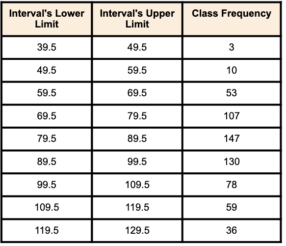
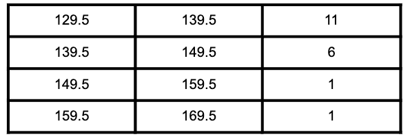

برای ساخت این جدول، بازه نمرات به بازه های کوچکتری تقسیم شد، به نام بازه کلاس، اولین بازه از ۳۹.۵ تا ۴۹.۵ بود. دومین بازه از ۴۹.۵ تا ۵۹.۵ بود و غیره. 
بعد، تعداد نمراتی که درون هر کدام از بازه ها می افتاد شمرده شد تا تعداد کلاس بدست بیاید. سه امتیاز در بازه اول وجود داشت. ۱۰ در دومین و غیره.
	بازه های کلاس با عرض ۱۰ میتواند جزییات خوبی راجب توزیع به ما بگوید بدون اینکه نمودار را بیش از حد ناپیوسته کند. اطلاعات بیشتر راجب تعیین بازه کلاس در ادامه بخش ارائه می شود. قرار دادن حد بازه کلاس بین دو عدد (مانند ۴۹.۵) ما را مطمئن می کند که تمام مقادیر درون یک بازه میفتاد تا روی مرزهای بین بازه ها.
	در هیستوگرام، فراوانی کلاس ها با میله نمایش داده می شود. ارتفاع هر میله نشان دهنده فراوانی آن کلاس است. یک هیستوگرام با این داده ها در شکل۱ نمایش داده شده است.

شکل۱. هیستوگرام نمرات بر روی آزمون روانشناسی

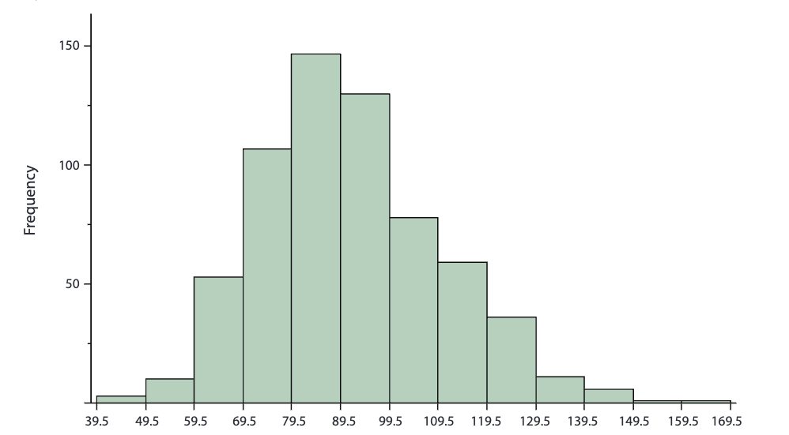

این هیستوگرام به وضوح می گوید که بیشتر نمرات در وسط توزیع هستند. با نمرات کمتری که در مقادیر حدی هستند. شما همچنین می توانید ببینید که توزیع ها متقارن نیستند: نمرات به سمت راست بیشتر می روند تا اینکه به سمت چپ بروند. به این توزیع گفته می شود که چولگی دارد. (ما بیشتر راجب شکل توزیع ها در فصل ۳ صحبت می کنیم)
	در مثال ما، مشاهدات ما اعداد کامل هستند. هیستوگرام ها همچنین می توانند در اندازه گیری های پیوسته مانند طول زمانی که یک کار طول می کشد (در میلی ثانیه) به ما کمک کنند. در این جا، نیازی به نگرانی راجب اعداد مرزی نیست. به همین دلیل ما می توانیم به صورت آزادانه اعداد طبیعی را برای مرزهای خودمان انتخاب کنیم برای مثال ۴۰۰۰، ۵۰۰۰ و غیره، فراوانی کلاس پس تعداد مشاهداتی است که بزرگتر یا مساوی با کران پایین است، و به الزام کوچکتر از کران بالا است. برای مثال، یک بازه می تواند زمانی بین ۴۰۰۰ تا ۴۹۹۹ میلی ثانیه باشد. استفاده از اعداد طبیعی به عنوان کران ها ظاهر را قابل درک تر می کند. و این روش بعضی از نرم افزار های کامپیوتری است که هیستوگرام می سازند. توجه کنید که بعضی از برنامه های کامپیوتری وسط هر بازه به جای انتهای بازه برچسب گذاری میکنند.
	