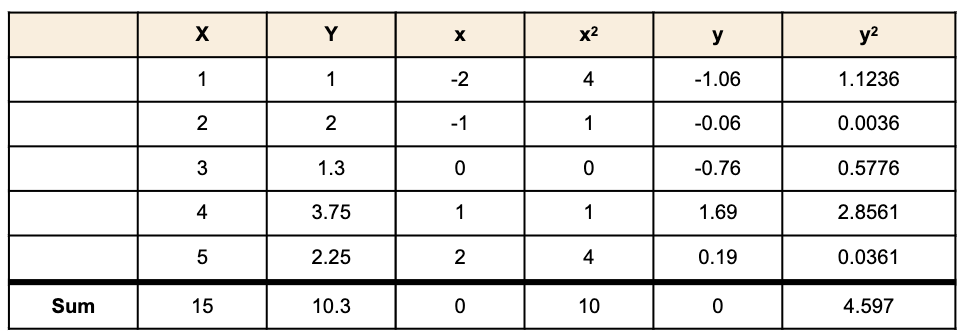
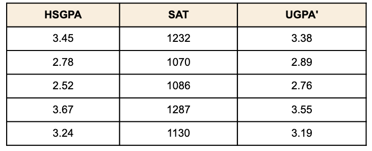
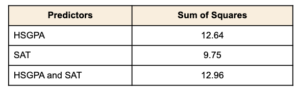
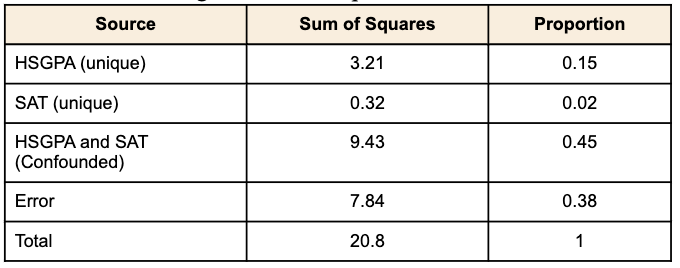
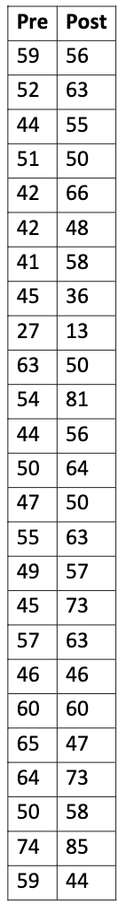
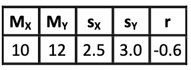
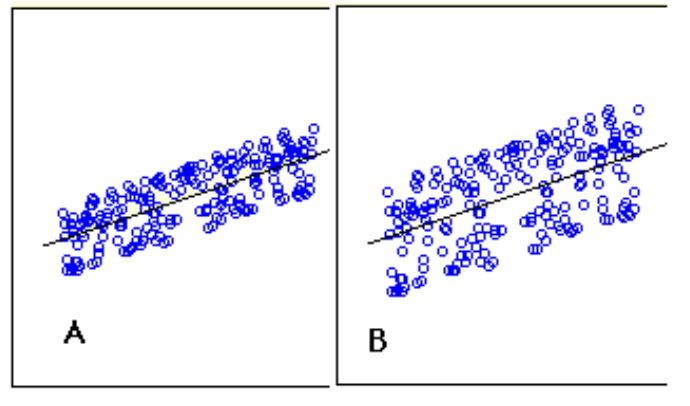

# فصل چهاردهم: رگرسیون

این فصل راجب پیش بینی هست.از آماردان ها اغلب خواسته می شود که روش هایی را توسعه دهند تا از روی یک متغیر، متغیر دیگر را بتوان پیش بینی کرد. به عنوان مثال، شاید کسی بخواهد که از میانگین نمرات دبیرستان، میانگین نمرات دانشگاه را پیش بینی کند. یا، یکی بخواهد از تعداد سال های تحصیل، درآمد را پیش بینی کند.
## مقدمه ای بر رگرسیون ساده خطی:

*پیش نیازها*
- فصل سوم: معیارهای پراکندگی 
- فصل چهارم: داده های دو متغیره

*هدف های یادگیری*
1. تعریف رگرسیون خطی
2. تشخیص خطای پیش بینی در یک نمودار پراکنش با کمک خط رگرسیون

در رگرسیون خطی ساده، ما مقادیر یک متغیر را از روی مقادیر متغیر دوم پیش بینی می کنیم.
آن متغیری که داریم پیش بینی می کنیم به نام متغیر مستقل و آن را با Y نمایش می دهند. آن متغیری که ما کل پیش بینی خودمان را روی آن قرار می دهیم به آن متغیر وابسته (متغیر پیشگو) می گوییم که با X آن را نشان می دهیم. وقتی که فقط یک متغیر پیشگو داشته باشیم، روش پیش بینی ما، رگرسیون ساده نامیده می شود. در رگرسیون ساده که موضوع این بخش هست، پیش بینی های Y، وقتی که تابعی از X رسم می شود یک خط راست را تشکیل میدهد.

داده مثال در جدول ۱، در رسم ۱ نشان داده شده است. می توان دید که بین X و Y یک رابطه مثبت وجود دارد. اگر بخواهیم که از روی متغیر X، متغیر Y را پیش بینی کنیم، هرچه مقدار X بیشتر باشد، مقدار پیش بینی شما از Y نیز بیشتر می شود.

 
 

رگرسیون خطی، شامل پیدا کردن بهترین خط راست برازش شده در میان نقطه ها است. بهترین خط برازش شده، خط رگرسیونی نامیده می شود. به خط مورب مشکی در رسم ۲ خط رگرسیونی گفته می شود و شامل مقدار Y برای تمام مقادیر ممکن X هست. خط های عمودی که از نقطه ها تا خط رگرسیونی رسم شده اند نشان دهنده خطای پیش بینی هستند. همانطور که می بینید، نقطه قرمز رنگ خیلی نزدیک خط رگرسیونی است، خطای پیش بینی آن نیز به همین سبب کوچک هست. بر خلاف آن، نقطه زرد بسیار بالاتر از خط رگرسیونی است و به همین خاطر خطای پیش بینی آن نیز بزرگ است. 

 
رسم۲. یک نمودار پراکنش برای داده های مثال. خط سیاه مورب خط پیش بینی هاست و نقطه ها، نشان دهنده داده های اصلی هستند، و خط های عمودی بین نقطه ها و خط مشکی نشان دهنده خطای پیشبینی هستند.

خطای پیشبینی برای یک نقطه معادل است با مقدار نقطه منهای مقدار پیشبینی شده (مقدار در خط). جدول۲ نشان دهنده مقادیر پیشبینی شده ( $\hat{Y}$) و خطای پیشبینی است ($Y - {\hat{Y}}$). برای مثال، اولین نقطه Y برابر 1.00 است و مقدار پیشبینی شده Y یا همان $\hat{Y}$ برابر است با 1.21. به همین دلیل، خطای پیشبینی برابر است با $-0.21$ 

جدول۲

 

ممکن است که متوجه شده باشید که ما دقیق توضیح ندادیم که منظورمان از *بهترین خط برازش* شده چیست. با اختلاف پراستفاده ترین معیار برای بهترین خط برازش شده، خطی هست که جمع توان دوم خطای پیشبینی را به حداقل می رساند. این معیاری است که خط را در شکل۲ پیدا کردیم. آخرین ستون در جدول۲ نشان دهنده توان دوم خطای پیشبینی است. جمع توان دوم خطای پیشبینی در جدول۲ کمتر از تمام جمع توان دوم دیگر خط های رگرسیونی است.
	فرمول برای خط رگرسیون برابر است :
	$$\hat{Y} = bX + A$$
وقتی که $\hat{Y}$ مقدار پیشبینی شده است، b شیب خط است، و A عرض از مبدا Y. 
معادله برای خط برای شکل ۲ برابر است با :

$$\hat{Y} = 0.425X + 0.785$$

برای X = 1,

$$\hat{Y} = 0.425(1) + 0.785 = 1.21$$

برای X=2,

$$\hat{Y} = 0.425(2) + 0.785 = 1.64$$

### محاسبه خط رگرسیون

در روزگار کامپیوترها، خط رگرسیون معمولا با نرم افزار های آماری محاسبه می شود. با این حال، محاسبات نسبتا آسان هستند و در اینجا قرار می گیرد برای کسانی که علاقمند هستند. محاسبات بر اساس آمارهایی که در جدول۳ نشان داده شده اند، $M_{X}$ میانگین X هست و $M_{Y}$ میانگین Y هست، $s_{X}$ انحراف معیار X و $s_{Y}$ انحراف معیار برای Y است و r هم همبستگی برای X و Y است.

جدول۳

 

شیب خط (b) میتواند به این شکل محاسبه شود:

$$b = r\frac{S_{y}}{S_{X}}$$

و عرض از مبدا (A) میتواند به این شکل محاسبه شود:

$$A = M_{Y} - bM_{X}.$$

برای این داده ها:

$$b = (0.627)\frac{1.072}{1.581} = 0.425$$

$$A = 2.06 - (0.425)(3) = 0.785$$

این نکته را در نظر داشته باشید که محاسبات انجام شده بر اساس آماره نمونه هستند تا اینکه بر اساس پارامترهای جامعه باشند. فرمول یکی است، به سادگی از مقدار پارامتر برای میانگین ها، انحراف معیارها، و همبستگی استفاده کنید.

### متغیرهای استاندارد شده

معادله رگرسیونی ساده تر می شود اگر متغیرها، استاندارد شده باشند به این معناست که میانگین آن برابر ۰ هست و انحراف معیار آن برابر ۱ است، به همین دلیل $b = r$ و $A = 0$ می شود و خط رگرسیونی به این شکل می شود.

$$Z_{\hat{Y}} = (r)(Z_{X})$$

در اینجا $Z_{\hat{Y}}$ مقادیر استاندارد پیشبینی برای $Y$ است، r همبستگی است، و $Z_{X}$ مقدار استاندارد شده برای X است. توجه کنید که شیب معادله رگرسیونی برای متغیرهای استاندارد شده برابر r است.
شکل۳ نشان دهنده یک نمودار پراکنش با خط رگرسیونی است که دارد از نمرات استاندارد شده ریاضی در آزمون SAT، نمرات استاندارد شده شفاهی SAT را پیشبینی می کند.

### یک مثال واقعی

تحقیق "آزمون SAT و معدل دانشگاه" شامل نمرات دبیرستان و دانشگاه برای ۱۰۵ دانشجوی رشته علوم کامپیوتر است. حالا ما در نظر می گیریم که چطور می شود معدل دانشگاه دانش آموزان را پیشبینی کرد با دانستن معدل دبیرستان آنها.
	شکل۳ نشان دهنده یک نمودار پراکنش از معدل دانشگاه به عنوان تابعی از معدل دبیرستان آنها است. شما میتوانید ببینید که یک رابطه مستقیم قوی وجود دارد. همبستگی برابر است با 0.78 و معادله رگرسیونی برابر است با
$$University GPA = (0.675)(HighSchoolGPA) + 1.097$$

با این تفاسیر، یک دانش آموز با معدل GPA دبیرستان ۳، پیش بینی می شود که معدل GPA دانشگاه آن برابر است با:

$$UniversityGPA = (0.675)(3) + 1.097 = 3.12.$$

شکل۳

### فرض ها

شاید برای شما عجیب باشد، اما محاسباتی که در این بخش انجام شده بدون فرض هستند. البته که رابطه بین X و Y خطی نیست، یک تابع با شکلی متفاوت میتواند داده ها را بهتر برازش کند. آمار استنباطی در رگرسیون بر اساس چندین فرضیات بنا شده اند، و این فرضیات در بخش بعدی همین فصل ارائه می شوند.

## تجزیه جمع مربعات:

*پیش نیازها*
- فصل ۱۴: مقدمه ای بر رگرسیون خطی

*هدف های یادگیری*
1. محاسبه جمع توان دوم Y
2. تبدیل داده های خام به داده های انحرافی
3. محاسبه داده های پیشبینی شده از معادله رگرسیونی
4. تجزیه جمع توان دوم  Y به جمع توان دوم پیشبینی شده و جمع توان دوم خطا
5. تعریف $r^2$ در قالب جمع توان دوم های توضیح داده شده و جمع توان دوم Y

یک بخش مفید رگرسیون این است که می توانیم پراکندگی Y را به دو بخش تجزیه کنیم: پراکندگی مقادیر پیشبینی شده و پراکندگی خطای پیشبینی ها. به پراکندگی Y، جمع توان دوم Y گفته می شود و به صورت جمع توان دوم پراکندگی Y از میانگین Y تعریف می شود. در جامعه این فرمول به این شکل است:

$$SSY = \sum (y-\mu_{Y})^2$$

جایی که SSY جمع توان دوم Y هست. و y یکی از مقادیر Y است و $\mu_{Y}$ مقدار میانگین Y است. یک مثال ساده در جدول۱ بیان شده است. میانگین Y برابر 2.06 است و SSY برابر جمع مقادیر در ستون سوم است و برابر است با 4.597.

جدول۱

وقتی که در نمونه محاسبه می شود، باید از میانگین نمونه (M) استفاده کنیم، به جای میانگین جامعه :

$$SSY = \sum (Y - M_{Y})^2$$

بعضی اوقات بهتر است که از فرمول هایی استفاده کنیم که از انحراف میانگین استفاده کنند تا از داده های خام. انحراف از میانگین همانطوری که از اسم آن پیداست همان فاصله هر مقدار تا میانگین است. طبق قرارداد، برای نشان دادن انحراف از میانگین از حروف های کوچک استفاده می شود. به همین دلیل مقدار y نشان دهنده تفاوت بین Y و میانگین Y است. جدول۲ نشان دهنده استفاده از این نوع نوشتار هست. اعداد مانند جدول۱ هستند.

جدول۲. مثالی از SSY با استفاده از انحراف از میانگین

داده ها در جدول۳ از بخش مقدمه تولید شده اند. ستون X مقادیر متغیر پیشگو است و ستون Y متغیر معیار است. ستون سوم y حاصل تفاوت Y از میانگین Y است.

جدول۳: داده مثال. آخرین سطر شامل جمع ستونی است.

ستون چهارم، $y^2$ ، توان دوم ستون y هست. ستون $Y'$ شامل مقادیر پیشبینی شده Y هست. در بخش مقدمه، نشان داده شد که معادله برای رگرسیون برای این داده ها عبارت است از:

$$\hat{Y} = 0.425X + 0.785$$

مقادیر $Y'$ طبق این معادله محاسبه شده بودند، ستون $y'$ شامل انحراف $Y'$ از میانگین $Y'$ است و $y'^2$ توان دوم این ستون است. ستون یکی مانده به آخری، $Y - Y'$ شامل مقادیر واقعی (Y) منهای مقادیر پیشبینی شده (Y') است, آخرین ستون شامل مربع خطای پیشبینی است.
	الان در وضعیتی هستیم که ببینیم که چطور SSY تجزیه می شود. به یاد بیاورید که SSY جمع مربعات انحراف از میانگین است. به همین دلیل جمع ستون $y^2$ است و برابر است با 4.597. SSY میتواند به دو بخش تجزیه شود: جمع مربعات پیشبینی ها $(SSY')$ و جمع مربع خطاها (SSE). جمع مربعات پیشبینی، جمع توان دوم انحراف از میانگین مقادیر پیشبینی از میانگین مقادیر پیشبینی می باشد. به تفسیر دیگر، جمع ستون $y'^2$ است و برابر است با 1.806. حاصل جمع توان دوم خطا همان جمع توان دوم خطاهای پیشبینی است. با این وجود جمع ستون  $(Y - Y')^2$ برابر است با 2.791. این می تواند به این شکل جمع شود:

$$SSY = SSY' + SSE$$

$$4.597 = 1.806 + 2.791$$

نکات مهم بیشتری راجب جدول۳ وجود دارد. اول از همه اینکه، توجه کنید که جمع y و جمع $y'$ هر دو برابر صفر است. این حالت همیشه برقرار است به دلیل اینکه این متغیره به وسیله تفریق میانگین از هر مقدار از آن درست شده اند. همچنین توجه کنید که میانگین ، $Y - Y'$ برابر صفر است. این نشان می دهد که با اینکه مقادیر Y بیشتر از مقادیر پیش بینی شده خودشان هستند و بعضی از آن کمتر هستند، میانگین تفاوت آن ها صفر است.
	در اینجا SSY جز کلی است، و $SSY'$ جز تغییرات توضیح داده شده است، و SSE جز تغییرات توضیح داده نشده است. با توجه به این، نسبت جزهای تغییرات توضیح داده شده می تواند به این صورت محاسبه شود:

نسبت جز تغییرات توضیح داده شده = $\frac{SSY'}{SSY}$

به صورت مشابه، نسبت تغییرات توضیح داده نشده برابر است با:

$$\frac{SSE}{SSY}$$

یک رابطه مهمی بین نسبت تغییرات توضیح داده شده و همبستگی پیرسون هست: $r^2$ نسبت تغییرات توضیح داده شده است، به همین دلیل اگر r=1 باشد، پس به طور طبیعی ، نسبت تغییرات توضیح داده شده 1 است. اگر r=0 باشد پس نسبت تغییرات توضیح داده شده برابر 0 است. آخرین مثال: برای r=0.4 نسبت تغییرات توضیح داده شده برابر 0.16 است.
	به دلیل اینکه واریانس با از تقسیم پراکندگی بر N (برای جامعه) و N-1 (برای نمونه) محاسبه می شود، روابط گفته شده در بالا نیز برای واریانس هم کار می کنند. برای مثال،

$$\sigma_{total}^2 = \sigma_{Y'}^2 + \sigma_{e}^2$$

جایی که اولین جمله واریانس کل است، دومین جمله واریانس $Y'$ است، و آخرین جمله واریانس خطای پیشبینی است $(Y-Y')$, به صورت مشابه، $r^2$ نسبت واریانس توضیح داده شده و همچنین نسبت تغییرات توضیح داده شده است.

### جدول خلاصه

خلاصه کردن جزهای داده ها در یک جدولی مثل جدول۵ اغلب کار درست و پسندیده ای است. ستون درجه آزادی (df) نشان دهنده درجه آزادی برای هر منبع تغییرات است. درجه آزادی برای جمع توان دوم توضیح داده شده ها برابر است با تعداد متغیرهای پیشگو، این  در رگرسیون ساده همیشه برابر ۱ است. درجه آزادی خطا برابر است با تعداد مشاهدات منهای ۲. در این مثال، $5-2=3$. درجه آزادی کلی تعداد مشاهدات منهای ۱ است.

جدول۴. جدول خلاصه شده داده های مثال

## خطای استاندارد برآورد:

*پیش نیازها* 
- فصل۳: معیارهای پراکندگی
- فصل ۱۴: مقدمه ای بر رگرسیون خطی
- فصل ۱۴: تجزیه جمع توان دوم ها

*هدف های یادگیری*
1. قضاوت درباره اندازه خطای استاندارد برآورد از نمودار پراکنش
2. محاسبه کردن خطای استاندارد برآورد، براساس خطاهای پیشبینی
3. محاسبه خطای استاندارد با استفاده از همبستگی پیرسون
4. برآورد خطای استاندارد برآورد براساس نمونه

شکل۱ نشان دهنده دو مثال رگرسیون است. میتوانید ببینید که در نمودار A، نقطه ها نزدیک تر به خط هستند تا در نمودار B. به همین دلیل، پیشبینی در نمودار A، درست تر هستند تا در نمودار B.

شکل۱. تفاوت رگرسیون ها در دقت پیشبینی.

خطای استاندارد برآورد یک معیاری برای برای دقت پیشبینی هاست. به یاد بیاورید که خط رگرسیون، خطی است که جمع توان دوم انحرافات پیشبینی را مینیمم می کند (همچنین از آن به عنوان جمع توان دوم خطا نیز یاد می شود). خطای استاندارد پیشبینی به شکل زیادی به این کمیت که در پایین تعریف شده است رابطه دارد:

$$\sigma_{est} = \sqrt{\frac{\sum(Y-Y')^2}{N}}$$

زمانی که $\sigma_{est}$ خطای استاندارد برآورد است، Y داده های واقعی است، $Y'$ داده های پیشبینی شده هستند، و N تعداد جفت داده ها است. در صورت جمع توان دوم داده های واقعی منهای داده های پیشبینی شده هستند. 

به شباهت فرمول $\sigma_{est}$ و فرمول $\sigma$ توجه کنید:

$$\sigma_{est} = \sqrt{\frac{\sum(Y-\mu)^2}{N}}$$

در حقیقت، $\sigma_{est}$ انحراف معیار خطاهای پیشبینی است (هر $Y-Y'$  یک خطای پیشبینی هستند).
	فرض کنید که داده ها در جدول۱، داده از جامعه با 5 جفت X , Y هست.

جدول۱. داده مثال.

آخرین ستون نشان دهنده جمع توان دوم پیشبینی است برابر 2.791. به همین دلیل، خطای پیشبینی استاندارد برابر است با:

$$\sigma_{est} = \sqrt{\frac{2.791}{5}} = 0.747$$

یک نسخه دیگری از این فرمول وجود دارد که خطای استاندارد را در همبستگی پیرسون می سنجد:

$$\sigma_{est} = \sqrt{\frac{(1-\rho^2)SSY}{N}}$$

جایی که $\rho$ مقدار همبستگی پیرسون از جامعه است و SSY برابر است با:

$$SSY = \sum(Y-\mu_{Y})^2$$

برای داده در جدول۱، $m_{y} = 10.30$  ,  $SSY = 4.587$ و  $r = 0.6268$ . به همین دلیل،

$$\sigma_{est} = \sqrt{\frac{(1-0.6268^2)(4.597)}{5}} = \sqrt{\frac{2.791}{5}} = 0.747$$

که همان مقدار محاسبه شده در گذشته است.
	به صورت مشابه یک سری فرمول هایی استفاده می شود که خطای استاندارد پیشبینی را محاسبه می کند زمانی که داده ها از یک نمونه آمده اند تا از یک جامعه. تنها تفاوت این است که مخرج آن به جای N برابر N-2 است. دلیل استفاده از N-2 به جای N-1 دو پارامتر (شیب خط و عرض از مبدا) برآورد شدند تا جمع توان دو ها را بدست بیاوریم. فرمولهایی که برای نمونه استفاده می شوند و قابل مقایسه با فرمولهای جامعه هستند در پایین نمایش داده می شوند:

$$\sigma_{est} = \sqrt{\frac{\sum(Y-Y')^2}{N-2}}$$

$$\sqrt{\frac{2.791}{3}} = 0.964$$

$$\sigma_{est} = \sqrt{\frac{(1-r^2)SSY}{N}}$$

## استنباط آماری برای b و r:

*پیش نیازها* 
- فصل۹: توزیع نمونه ای r
- فصل۹: فاصله اطمینان برای r 

*هدف های یادگیری*
1. بیان فرضیاتی که رگرسیون براساس استنباط آماری آنها ساخته شده است.
2. شناخت ناهمسانی واریانسی (heteroscedasticity) در نمودار پراکنش
3. محاسبه خطای استاندارد شیب خط
4. تست کردن شیب خط برای معنی داری
5. ساختن فاصله اطمینان روی شیب خط
6. تست کردن همبستگی برای معنی داری
7. ساختن فاصله اطمینان برا همبستگی

این بخش نشان می دهد که چگونه می شود که یک تست معنی داری را اجرا کرد و فاصله اطمینان را برای شیب خط رگرسیون و همبستگی پیرسون بدست آورد. همانطوری که خواهید دید، اگر شیب خط رگرسیونی به صورت معنی داری با صفر متفاوت باشد، به همین دلیل ضریب همبستگی نیز به صورت معنی داری متفاوت با صفر است.

### فرضیات:

با اینکه هیچ فرضیاتی نیاز نبود که بهترین خط صاف برازش داده شده را پیدا کنیم، در محاسبه استنباط های آماری فرضیاتی درست خواهند شد. به طور طبیعی، این فرضیات به جامعه اشاره دارند نه به نمونه.

1. خطی بودن: رابطه بین دو متغیر خطی است.
2. همسانی واریانس: واریانس در اطراف خط رگرسیون ثابت است برای تمام مقادیر X. به وضوح این فرض در شکل۱ رد شده است. توجه کنید که پیشبینی برای دانش آموزانی که معدل دبیرستان آنها بالا بود به خوبی انجام شده است، ولی پیشبینی برای دانش اموزان دبیرستانی با معدل پایین خیلی خوب نیست. با یک تفسیر دیگر، نقاطی که برای دانش آموزان با معدل بالای دبیرستان است نزدیک به خط رگرسیونی است و نقاطی که برای دانش آموزان دبیرستانی با معدل پایین از خط رگرسیونی فاصله دارند.

شکل۱. معدل دانشگاه به عنوان تابعی از معدل دبیرستان.

3. خطاهای پیشبینی به صورت نرمال توزیع شده اند. این به این معناست که توزیع انحراف از خط رگرسیونی به صورت نرمال توزیع شده است. این به این معنا نیست که X یا Y به صورت نرمال توزیع شده باشند.

### آزمون معنی داری برای شیب (b)

فرمول کلی برای آزمون t را به یاد بیاورید:

$$t = \frac{statistics - hypothesized \space value}{estimated\space standard \space error \space of \space statistic}$$

همانطوری که در اینجا دیدیم. آماره مقدار نمونه شیب است (b) و مقدار فرض ما صفر است. درجه آزادی برای این آزمون هم :

$$df = N-2$$

جایی که N تعداد جفت های مقادیر است.

خطای استاندارد برآورد b به شکل زیر محاسبه می شود:

$$s_b = \frac{S_{est}}{\sqrt{SSX}}$$

جایی که $s_b$ خطای استاندارد برآورد b است، $S_{est}$ خطای استاندارد برآورد است، و SSX جمع توان دوم انحراف از میانگین X است. SSX به شکل زیر محاسبه می شود

$$SSX = \sum (X-M_x)^2$$

جایی که $M_x$ میانگین X است. همانطور که قبلا نشان داده شد، خطای استاندارد برآورد را میتوان به این شکل محاسبه کرد

$$S_{est} = \sqrt{\frac{(1-r^2)SSY}{N-2}}$$

این فرمول ها در جدول۱ نمایش داده شده اند. این داده ها از بخش مقدمه گرفته شده اند. ستون X مقادیر متغیر پیشگو است و ستون Y مقادیر ستون معیار (هدف) است. سومین ستون ,x, دارای تفاوت بین مقادیر X و مقادیر میانگین X است. چهارمین ستون $x^2$ توان دوم ستون x است. ستون پنجم y شامل تفاوت بین مقادیر ستون Y و میانگین Y است. آخرین ستون $y^2$ فقط توان دوم ستون y است.

جدول۱. داده مثال

محاسبه خطای استاندارد برآورد $(s_{est})$ برای این داده در بخش خطای استاندارد برآورد نشان داده شده است و برابر است با 0.964.

$$S_{est} = 0.964$$

در اینجا SSX جمع توان دوم انحراف از معیار X است. با این حال برابر است با جمع ستون $x^2$ و برابر است با 10.

$$SSX = 10$$

الان تمام اطلاعات لازم برای محاسبه خطای استاندارد b را در اختیار داریم:

$$s_b = \frac{0.964}{\sqrt{10}} = 0.305$$

همانطوری که در قبل نشان داده شد، شیب خط b برابر است با 0.425 ، به همین دلیل.

$$t = \frac{0.425}{0.305} = 1.39$$

$$df = N-2 = 5-2 - 3.$$

در اینجا p_value برای آزمون t ، دو طرفه برابر است با 0.26  به همین دلیل، شیب خط فرق معنی داری با صفر ندارد.

### فاصله اطمینان برای شیب

روش محاسبه فاصله اطمینان برای شیب جامعه بسیار شبیه به روش محاسبه دیگر فاصله اطمینان ها است. برای فاصله اطمینان 95% ، فرمول به این شکل است؛

کران پایین:

$$b - (t_{0.95})(s_b)$$

کران بالا:

$$b + (t_{0.95})(s_b)$$

جایی که $t_{0.95}$ مقدار t استفاده شده برای فاصله اطمینان 95% است.
	مقادیری که برای t استفاده می شود در این فاصله اطمینان میشه در جدول توزیع t آن را پیدا کرد. یک نسخه کوچک این جدول در جدول۲ نشان داده شده است. اولین ستون df برای درجه آزادی است.

جدول۲. جدول t خلاصه شده

شما می توانید از ماشین حساب معکوس توزیع t استفاده کنید ([لینک خارجی](http://onlinestatbook.com/2/calculators/inverse_t_dist.html) :‌نیاز به جاوا دارد.) برای پیدا کردن مقادیر t در فاصله اطمینان.
	استفاده از فرمول ها برای داده های مثال.

کران پایین:

$$0.425 - (3.182)(0.305)= -0.55$$

کران بالا:

$$0.425+ (3.182)(0.305) = 1.40$$

### آزمون معنی داری برای همبستگی

فرمول آزمون معنی داری برای همبستگی پیرسون در پایین نمایش داده شده است:

$$t = \frac{r\sqrt{N-2}}{\sqrt{1-r^2}}$$

جایی که N تعداد جفت های داده ها است. برای داده های مثال،

$$t = \frac{0.628\sqrt{5-2}}{\sqrt{1-0.627^2}} = 1.39$$

توجه کنید که این همان مقداری t است که در آزمون b بدست آوردیم. همینطور در آن آزمون، درجه آزادی برابر $N-2 = 5-2 = 3$ است.

## مشاهدات تاثیرگذار:

*پیش نیازها* 
- فصل۱۴: مقدمه ای بر رگرسیون خطی

*هدف های یادگیری*
1. تعریف "تاثیر"
2. توضیح اینکه چه چیزی باعث تاثیرگذاری یک نقطه می شود
3. تعریف "اهرم"
4. تعریف "فاصله"

این امکان وجود دارد که یک نقطه تاثیر خیلی زیادی روی جواب تحلیل رگرسیونی داشته باشد. به همین دلیل مهم هست که در زمان بررسی نتایج به وجود مشاهدات تاثیرگذار نیز اشاره شود.

#### تاثیر

در مورد تاثیر یک مشاهده می شود به این شکل فکر کرد که چقدر تفاوت در پیشبینی به وجود می آید اگر آن مشاهدات را از مدل بر می داشتیم. معیار cook's D یک معیار خوبی برای بررسی تاثیر مشاهدات و به صورت نسبی به ارتباطی با جمع توان دوم تفاوت بین پیشبینی های انجام شده با وجود مشاهدات و پیشبینی انجام شده با در نظر نگرفتن آن مشاهدات است. اگر پیشبینی ها چه در زمان وجود و چه در زمان عدم وجود آن مشاهدات در نظر گرفته شده تفاوتی نداشته باشند، پس آن مشاهدات تاثیری روی مدل رگرسیونی ندارند. اگر پیشبینی های انجام شده تفاوت خیلی زیادی با زمانی آن مشاهدات در نظر گرفته نشده بوند داشته باشد، پس آن مشاهدات تاثیرگذار هستند.

یک قانون نانوشته ای وجود دارد که یک مشاهده با مقدار معیار Cook's D بالاتر از 1 تاثیر بسیار زیادی دارد. و این نکته لازم هست که بدانیم مانند تمام قوانین نا نوشته باید با قضاوت اعمال شود نه بدون تفکر.

تاثیر مشاهده یک تابعی از دو فاکتور است: ۱) تفاوت میان مقدار مشاهده شده از متیغر پیشگو و میانگین متغیر پیشگو چقدر است و ۲) تفاوت بین مقدار پیشبینی شده برای مشاهدات و مقدار اصلی آن چقدر است. فاکتور قبلی به نام اهرم مشاهدات است و دومین فاکتور به نام فاصله مشاهدات است.

#### محاسبه cook's D (اختیاری)

اولین قدم برای محاسبه مقدار Cook's D برای یک مشاهده این است که باید تمام مقادیر پیشبینی را براساس تمام مشاهدات با استفاده از معادله رگرسیونی پیشبینی کرد و یک بارهم تمام مشاهدات به جز آن مشاهده ای که میخواهیم بررسی کنیم. دومین قدم این است که تفاوت جمع توان دوم بین این دو مجموعه پیشبینی ها را محاسبه می کنیم. آخرین مرحله تقسیم کردن حاصل بر ۲ برابر MSE است (بخش تجزیه واریانس را مشاهده کنید).

#### اهرم

اهرم در یک مشاهده براساس تفاوت بیبن مقدار متغیر پیشگو و میانگین متغیر پیشگو است. هر چه اهرم یک مشاهده بزرگتر باشد، پتانسیل بیشتری برای مشاهده تاثیرگذار بودن را دارد. برای مثال، یک مشاهده با میانگین متغیر پیشگو هیچ تاثیری رو شیب خط رگرسیون بدون توجه به مقدار متغیر معیار (هدف) ندارد. ولی از سویی دیگر، اگر یک مشاهده در متغیرهای پیشگو extreme باشد، با توجه به فاصله آن، پتانسیل تاثیرگذاری زیادی روی شیب خط را دارد.

#### محاسبه اهرم (h)

قدم اول استاندارد کردن متغیر پیشگو است تا اینکه میانگین صفر و انحراف معیار یک داشته باشد. بعد از آن، اهرم (h) با محاسبه توان دوم مقادیر مشاهدات استاندارد شده متغیر پیشگو به علاوه یک و تقسیم بر تعداد مشاهدات به دست می آید.

#### فاصله

فاصله یک مشاهده براساس خطای پیشبینی برای مشاهدات به دست می آید: هرچه خطای پیشبینی بیشتر باشد، فاصله بیشتر است. معیاری که اکثر مواقع از آن استفاده می شود برای به دست آوردن فاصله باقی مانده استیودنت شده است. باقی مانده استیودنت شده برای یک مشاهده به طور زیادی در ارتباط با خطای پیشبینی برای آن مشاهده تقسیم بر انحراف معیار خطای پیشبینی است. با این حال، مقادیر پیشبینی شده از یک معادله رگرسیونی گرفته شده اند که خود آن مشاهده به حساب نیامده است. جزییات محاسبه باقی مانده استیودنت شده کمی پیچیده و خارج از مفاهیم این کتاب است.

یک مشاهده با فاصله زیاد تاثیر زیادی نخواهد داشت اگر اهرم آن کم باشد. ترکیب اهرم و فاصله مشاهده است که مقدار تاثیرگذاری را برای ما روشن می کند.

#### مثال

جدول۱ نشان دهنده اهرم، باقی مانده استیودنت شده، و تاثیر آن برای هر پنج مشاهده در این دیتاست کوچک است.

جدول۱، داده مثال

در جدول بالا h به عنوان اهرم است، R نشان دهنده باقی مانده استیودنت شده است و D نشان دهنده معیار تاثیرگذاری Cook است.

مشاهده A به نسبت اهرم بالایی دارد و به نسبت باقی مانده بالایی دارد و تقریبا تاثیرگذاری بالایی دارد.

مشاهده B به نسبت اهرم کمی دارد و به نسبت باقی مانده کوچکی دارد و تاثیرگذاری خیلی کمی دارد.

مشاهده C به نسبت اهرم کوچکی دارد و به نسبت باقی مانده بالایی دارد و تقریبا تاثیرگذاری به نسبت کمی دارد.

مشاهده D کمترین اهرم را دارد و در باقی مانده ها دومین مقدار را دارد با اینکه مقدار باقی مانده‌ آن بسیار بیشتر از مشاهده A است، تاثیرگذاری آن به دلیل اهرم کوچکی که دارد، بسیار کمتر است.

مشاهده E با فاصله زیادی بزرگترین اهرم و باقی مانده را دارد. این ترکیب اهرم و باقی مانده بالا این مشاهده را بسیار تاثیرگذار می کند.

شکل۱ نشان دهنده خط رگرسیون برای تمام دیتاست است (آبی) و اگر مشاهده ای که در نظر داریم در مدل نباشد، خط رگرسیون آن برای تمام مشاهدات به رنگ قرمز است. مشاهده ای که در نظر گرفته ایم دایره دور آن کشیده شده است. به طور طبیعی، خط رگرسیون برای تمام دیتاست مشابه است. باقی مانده به نسبت خطی که مشاهده آن را در نظر نگرفته ایم  محاسبه می شود. این موضوع برای مشاهده E قابل توجه است که مشاهده E بسیار نزدیک به خط رگرسیونی ای است که در زمان وجود آن محاسبه شده است ولی زمانی که از مدل حذف می شود بسیار با خط رگرسیون فاصله دارد.

شکل۱. طرحی از اهرم، باقی مانده و تاثیرگذاری

نقاطی که با دایره مشخص شده اند در محاسبه خط رگرسیون قرمز حضور ندارند، تمام نقاط در مدل رگرسیونی خط آبی حضور دارند.

## رگرسیون به سمت میانگین:

*پیش نیازها* 
- فصل۱۴: مقدمه ای بر رگرسیون خطی

*هدف های یادگیری*
1. توضیح اینکه رگرسیون به سمت میانگین چیست؟
2. توضیح اینکه در چه وضعیت هایی رگرسیون به سمت میانگین اتفاق میفتد؟
3. شناسایی وضعیت هایی که اگر رگرسیون به سمت میانگین را نادیده بگیریم به نتیجه ای نادرست می رسیم.
4. توضیح اینکه رگرسیون به سمت میانگین ارتباط داره با معادله رگرسیون.

رگرسیون به سمت میانگین شامل نتایجی است که حداقل تا حدی ناشی از شانس هستند. ما شروع میکنیم با یک مثالی که به صورت کامل بر پایه شانس است: تصور یک آزمایش را بکنید که گروهی از ۲۵ نفر که هر کس خروجی یک پرتاب سکه را پبش بینی میکند. برای هر فرد در آزمایش، یک سکه ۱۲ بار پرتاب می شود و هر فرد هر ۱۲ بار را پیشبینی میکند. شکل۱ نشان دهنده جوابهای این آزمایش است با اینکه بیشتر افراد ۵ تا ۸ تا را درست پیشبینی کرده بودند، یک فرد ۱۰ بار درست بود، به وضوح نمایان است که، این فرد بسیار خوش شانس بود و احتمال اینکه این اتفاق با تکرار این آزمایش رخ دهد بسیار پایین است. یا این حال، بهترین احتمال درست بودن پیش بینی ها ۶ است به دلیل اینکه احتمال درست بودن در این آزمایش ۰.۵ است و اینجا ۱۲ بار آزمایش شده است.

شکل۱. هیستوگرام جواب های آزمایش شبیه سازی شده.

اگر بخواهیم به صورت تکنیکی تر به این قضیه نگاه کنیم، بهترین پیشبینی برای جواب افراد در دوباره تست گرفتن، میانگین توزیع دوجمله ای است با N=۶ و p = ۰.۵۰ این توزیع در شکل۲ نشان داده شده است و میانگین آن ۶ است.

توزیع دوجمله ای برای N = ۱۲ و p = ۰.۵۰.

نکته ای که اینجا وجود دارد بیان می کند که بدون درنظر گرفتن اینکه چندتا پرتاب سکه را فرد درست پیشبینی کرده باشد، بهترین پیشبینی امتیاز آن ها در دوباره تست گرفتن برابر با ۶ است.

حالا یک تستی را در نظر می گیریم به نام تست A، که به نصف براساس شانس و نصف برساس استعداد هست: به جای اینکه ۱۲ پرتاب سکه را پیشبینی کنیم، هر فردی پرتاب ۶ سکه را پیشبینی می کند و به ۶ سوال درست/نادرست راجب تاریخ جهان جواب می دهد.

فرض میکنیم که میانگین امتیاز در ۶ سوال تاریخی برابر ۴ است. امتیاز فرد در تست A یک بخش بزرگی به شانس و دانش در تاریخ بر میگردد. اگر یک فردی امتیاز بالایی در این تست به دست بیاورد (مانند گرفتن امتیاز ۱۰ از ۱۲)، احتمال دارد که آن فرد هم در سوالات تاریخ و هم در پرتاب سکه بسیار خوب عمل کردند. برای مثال اگر آنها فقط ۴ سوال تاریخی را درست جواب داده باشند، آنها باید تمام ۶ پرتاب سکه را درست حدس زده باشند، و این نیاز به داشتن شانس بسیار خوب است. اگر تست B را تعریف کنیم که شامل پرتاب سکه و سوالات تاریخی باشد، دانش آنها راجب به تاریخ کمک کنند خواهد بود و انتظار می رود که بالاتر از میانگین امتیاز به دست بیاورند، با این حال، به دلیل اینکه عملکرد خوب آنها در بخش پرتاب سکه در تست A پیشبینی کننده عملکرد آنها در پرتاب سکه در تست B نمی شود. برای آنها انتظار نمی رود که هم در تست A و هم در تست B عملکرد یکسانی داشته باشند، بنابراین بهترین پیشبینی برای آنها در تست B یک جایی بین امتیاز آنها در تست A و میانگین تست B است. این میل موضوعات  که دارای شانس و مهارت است نمرات بالایی را کسب می کنند در آزمون مجدد به میانگین نزدیک تر می شوند، به این رگرسیون به سمت میانگین گفته می شود.

مفهوم پدیده رگرسیون به سمت میانگین این است که مردم با امتیاز بیشتر دارای مهارت و شانس بالاتر از میانگین هستند و فقط بخش مهارت برای معیارها و ارزیابی های آینده قابل استفاده هستند، به همین دلیل مردم با امتیاز های پایین دارای مهارت و شانس پایینتر از میانگین هستند و شانس بد آنها در آینده تاثیر گذار نخواهد بود. این موضوع به آن معنا نیست که تمام افرادی که دارای امتیاز بالا هستند، دارای شانس بالاتر از میانگین هستند با این حال، به صورت میانگین به این شکل است.
	تقریبا تمام معیارهای اندازه گیری یک رفتار، دارای قسمت شانس و مهارت هستند. به عنوان مثال نمره دانش آموزان را در امتحان پایانترم در نظر می گیریم، به طور حتمی، دانش دانش آموز راجب آن موضوع قسمت اصلی و تعیین کننده نمره او است. با این حال، یک زوایایی از نمره است که بر اساس شانس تعیین می شوند. امتحان همه چیز را در طول کلاس نمی تواند سوال بدهد و فقط بخشی از محتوای کلاس مورد سوال و سنجش قرار می گیرد. شاید یک دانش آموزی شانس خوبی داشت و یکی از موضوعاتی که به خوبی متوجه نشده بود در امتحان هم نیامد. یا شاید دانش آموز مطمئن نباشد که کدام از دو روش را انتخاب کند و با توجه به شانس روش درست را انتخاب کرده باشد. شانس میتواند در انواع مختلف وارد بازی شوند. شاید دانش آموز با یک تلفن صبح زود بیدار شده باشد و در نتیجه باعث خستگی و کارایی کمتر می شود. و میدانیم که حدس زدن در سوالات چند گزینه ای هم یک منبع تصادفی در نمرات آزمون هستند.

در شرایط تست و تست دوباره، رگرسیون به سمت میانگین وجود دارد زمانی که رابطه کمتر از بی نقص (r=1) بین تست و تست دوباره وجود داشته باشد. این از فرمول خط رگرسیون با متغیرهای استاندارد شده در پایین قابل مشاهده هست.

$$Z_{Y'} = (r)(Z_{X})$$

با توجه به این معادله واضح است که اگر مقدار قدر مطلق r کمتر از ۱ باشد، مقدار پیشبینی شده $Z_{Y}$ (میانگین برای مقادیر استاندارد شده) از $Z_{X}$ نزدیک تر به ۰ خواهد شد. همچنین، توجه کنید که اگر همبستگی بین X و Y صفر باشد، یک عملی است که به طور کلی وابسته به شانس است، مقدار استاندارد شده پیشبینی برای Y میانگین آن، یعنی ۰ است (بدون توجه به مقدار در X).

شکل۳ نشان دهنده نمودار پراکنش است با خط رگرسیونی است که در حال پیشبینی کردن نمرات SAT استاندارد شده لغات از نمرات استاندارد شده SAT ریاضی است. توجه کنید که شیب خط برابر است با همبستگی بین این دو متغیر که برابر است با  ۰.۸۳۵ .

شکل۳. پیشبینی نمرات استاندارد شده SAT لغات نسبت به نمرات استاندارد شده SAT ریاضی

نقطه ای که با الماس آبی نشان داده شده است مقدار ۱.۶ در نمرات استاندارد شده SAT گرفته است. این بدان معناست که این دانش آموز نمره ای ۱.۶ انحراف معیار بالاتر از میانگین در نمره ریاضی بدست آورده است. مقدار پیشبینی شده برابر است با  $1.34=(1.6)(0.835) = (1.6)(r)$. خط افقی نشان دهنده مقدار پیشبینی شده است. نکته اصلی این است که با اینکه این دانش آموز ۱.۶ انحراف معیار بالاتر از میانگین نمرات ریاضی آورده است، پیشبینی شده است که او فقط ۱.۳۴ انحراف معیار بالاتر از میانگین نمره لغات آورده است، با این حال پیشبینی شده است که نمره لغات از نمرات ریاضی نزدیک تر به صفر خواهد بود. به طور مشابه، یک دانش آموز که پایینتر از میانگین نمره ریاضی اوست، نمره لغات او بالاتر پیشبینی می شود.

رگرسیون به سمت میانگین در وضعیت هایی اتفاق می افتد که مشاهداتی که انتخاب می کنیم پایه کارایی آنها در عمل دارای قسمت تصادفی است. اگر شما کسانی را بر پایه عملکرد آنها انتخاب کنید. شما کسانی را انتخاب می کنید قسمتی بر اساس مهارت آنها و قسمتی بر اساس شانس آنها در آن عمل. با توجه به اینکه نمیتوان انتظار داشت که شانس آنها در هر تکرار حفظ شود، بهترین پیشبینی برای عملکرد یک فرد در تکرار دوم یک جایی بین عملکرد آنها در تکرار اول (قبلی) و میانگین عملکرد در تکرار اول است. میزان درجه ای که انتظار می رود مقادیر به به سمت میانگین رگرس کنند به میزان تاثیرگذاری نسبی شانس و مهارت در آن عمل است: هر چه نقش شانس بیشتر باشد، ما رگرسیون به سمت میانگین بیشتری نیز داریم.

### خطاهایی به وجود آمده از درک نکردن رگرسیون به سمت میانگین

ناتوانی در درک و تحسین رگرسیون به سمت میانگین بسیار رایج و اغلب اوقات باعث برداشت ها و نتیجه گیری های نادرست می شود. یکی از بهترین مثال ها در اتوبیوگرافی برنده جایزه نوبل آقای دنیل کاهنمن هست ([لینک به بیرون](http://www.nobelprize.org/nobel_prizes/economics/laureates/2002/kahneman-autobio.html)). دکتر کاهنمن داشتند به آموزش دهنده های پرواز یاد می دادند که تشویق بهتر از مجازات هست. او توسط یکی از آموزش دهنده ها به چالش کشیده شد که بر اساس تجربه او آموزش شونده هایی که یک مانور را درست انجام میدهند و تشویق می شوند باعث پایین آمدن کیفیت عملکرد آنها می شود، ولی فریاد بر سر دانشجو برای عملکرد بد، انتظار کیفیت بالاتر در عملکرد وجود خواهد آمد. این، البته چیزی است که از رگرسیون به سمت میانگین انتظار می رود. عملکرد یک خلبان، همچنین که قسمت بزرگی از آن وابسته به مهارت است، این عملکرد مانور به مانور به صورت تصادفی متغیر است. وقتی که یک خلبان یک مانور را به صورت خیلی تمیز انجام می دهد، احتمال دارد که به علاوه مهارت قابل توجه اش کمی شانس نیز داشته است. بعد از تشویق نه به دلیل آن. بخش شانس احتمالا از بین می رود و عملکرد آنها نیز کاهش میابد. به طور مشابه، یک عملکرد بد احتمالا بخشی از آن به دلیل شانس است. بعد از انتقاد ولی نه به دلیل آن، عملکرد بعدی احتمالا بهتر خواهد بود. برای اینکه این نکته را بهتر متوجه شویم، برای روشن شدن این نکته، کانمن از هر مربی خواست تا وظیفه‌ای را انجام دهد که در آن یک سکه دو بار به سمت هدف پرتاب می‌شد. او نشان داد که عملکرد کسانی که بار اول بهترین عملکرد را داشتند، بدتر شد، در حالی که عملکرد کسانی که بدترین عملکرد را داشتند، بهبود یافت.
	رگرسیون به سمت میانگین به طور معدد در عملکرد ورزشی نمایان می شود. یک مثال خوب که توسط Schall and Smith (2000) بیان شد، آنها زوایای مختلف ورزش بیسبال را تحلیل کرده بودند همچنین میانگین تعداد ضربات هر بازیکن در سال ۱۹۹۸. آنها ۱۰ بازیکن را انتخاب کردند که بالاترین میانگین ضربه را در سال ۱۹۹۸  داشتند (BAs) و چک کردند تا ببینند که در سال ۱۹۹۹ چقدر خوب عمل کردند. بر اساس چیزی که راجب رگرسیون به سمت میانگین می دانیم انتظار می رود که این بازیکنان، به صورت میانگین باید میانگین ضربات کمتری در سال ۱۹۹۹ داشته باشند نسبت به سال ۱۹۹۸. همانطور که در جدول۱ دیده می شود، ۷ تا از ۱۰ بازیکن میانگین ضربات کمتری در سال ۱۹۹۹ داشتند تا در سال ۱۹۹۸. و کسانی که در سال ۱۹۹۹ بالاترین بودند، کمی بالاتر بودند وبی کسانی که پایینتر بودند بسیار پایینتر شدند. کاهش میانیگن از سال ۱۹۹۸ تا سال ۱۹۹۹، ۳۳ ضربه بود. با اینحال، بیشتر این بازیکنان در سال ۱۹۹۹ میانگین ضربات فوق العاده ای داشتند، که این نشان دهنده آن است که مهارت بخش بزرگی از میانگین آنها در سال ۱۹۹۸ بود.

جدول۱، ده بازیکن با بیشترین میانیگن ضربات در سال ۱۹۹۸ در سال ۱۹۹۹ چگونه عمل کردند.

شکل۴ نشان دهنده میانگین ضربات آن دو سال است. افتی که از سال ۱۹۹۸ تا ۱۹۹۹ داشتیم واضح است. توجه کنید که با اینکه میانگین از سال ۱۹۹۸ نزول کرده است، بعضی بازیکنان میانگین ضربات خودشان را افزایش دادند. این نشان دهنده رگرسیون به سمت میانگین برای یک شخص رخ نمی دهد، با این حال مقدار پیشبینی شده برای هر شخص پایینتر خواهد بود، بعضی از این پیشبینی ها اشتباه هستند.

شکل۴، نمودار چارک از میانگین ضربات، خط آبی میانگین این دو نمودار را بهم وصل می کند.

رگرسیون به سمت میانگین نقش  در چیزی به نام "رکود سال دوم" دارد، یک مثال خوب این است که بازیکنی که برنده جایزه "تازه کار سال" می شود، معمولا در فصل دوم بدتر عمل می کند. یک پدیده مرتبط به نام Sports Illustrated Cover Jinx نام دارد.
	یک آزمایش بدون گروه کنترل، می تواند تاثیرات رگرسیونی را با تاثیرات دنیای واقعی اشتباه بگیرد. برای مثال ، یک آزمایش فرضی را در نظر بگیرید برای ارزیابی برنامه مرتبط با پیشرفت کردن در خواندن. تمام کلاس اولی ها در مدرسه یک آزمونی دادند و ۵۰ تا از پایینترین نمرات در این برنامه ثبت نام شدند.از این دانش آموزان سپس دوباره آزمونی بعد از برنامه گرفته شد و میانگین پیشرفت بسیار زیاد بود. آیا این بدان معناست که این برنامه تاثیرگذار بود؟ خیر، می توان عملکرد بد اولیه دانش آموزان بخشی به دلیل شانس بد آن ها باشد. شانس آنها انتظار می رود که در آزمون دوباره پیشرفت کرده باشد، که این به معنای این است که آنها نمرات خودشان افزایش می دادند چه با این برنامه و یا چه بدون آن.

برای یک مثال واقعی، یک آزمایشی را در نظر بگیرید که قصد دارد که نشان دهد آیا داروی پروپانول باعث افزایش نمره SAT دانش آموزانی  می شود که فکر می کنند دارای اضطراب آزمون هستند ([لینک خارجی]()). پروپانول به ۲۵ دانش آموز دبیرستانی داده شد و دلیل انتخاب این ۲۵ نفر آن بود که در آزمون های IQ و بقیه عملکردهای آکادمیک نشان می داد که آنها به خوبی که انتظار می رفت عمل نکرده بودند در SAT. در آزمون دوباره ای که بعد از مصرف پروپانول از آنها گرفته شد، نمره SAT دانش آموزان به صورت میانگین ۱۲۰ واحد افزایش پیدا کرده بود. این به صورت معناداری افزایش خیلی بیشتری در ۳۸ واحد افزایش مورد انتظار ما قبل از انجام آزمون دوباره بود. مشکل این تحقیق آن است که روشی که برای انتخاب دانش آموزان استفاده شد احتمالا باعث انتخاب نامتناسب دانش آموزانی شد که در اولین آزمون SAT بد شانسی آورده بودند، به همین دلیل، این دانش آموزان احتمالا نمرات خودشان را افزایش میدادند همراه با یا بدون قرص پروپانول. این به آن معنا نیست که پروپانول هیچ تاثیری نداشته است، با اینحال زمانی که اثر احتمالی پروپانول و اثر رگرسیونی با هم مخلوط شده بودند، هیچ نتیجه گیری محکمی قابل برداشت نیست.
	گذاشتن دانش آموزان  در گروه پروپانول و  در گروه کنترل به صورت تصادفی باعث افزایش کیفیت طراحی آزمایش می شد. از آنجایی که اثر رگرسیون در آن صورت، به صورت سیستماتیک برای هر دو گروه متفاوت نبود، یک تفاوت معنادار مدرک خوبی برای تاثیر پروپانول میتوانست باشد.

## مقدمه ای بر رگرسیون چندگانه:

*پیش نیازها* 
- فصل۱۴: رگرسیون ساده خطی
- فصل۱۴: تجزیه جمع مربعات
- فصل۱۴: خطای استاندارد برآورد
- فصل۱۴:  استنباط آماری برای b و r

*هدف های یادگیری*
1. بیان معادله رگرسیونی
2. تعریف 'ضریب رگرسیون'
3. تعریف 'وزن بتا'
4. توضیح اینکه R چیست و چه نسبتی به r دارد؟
5. توضیح اینکه وزن رگرسیون به نام شیب جزئی شناخته می شود
6. توضیح اینکه چرا جمع مربع در مدل رگرسیونی چندگانه اغلب اوقات کمتر از مربع جمعِ جمع در رگرسیون ساده است
7. تعریف $R^2$ براساس نسبت توضیح داده شده
8. آزمون $R^2$ برای معناداری
9. آزمون تفاوت بین مدل کامل و ناقص برای معناداری
10. بین فرضیات رگرسیون چندگانه و مشخص کردن اینکه کدام بخش تحلیل نیازمند فرضیات است

در رگرسیون خطی ساده، یک متغیر معیار از یک متغیر پیشگو پیشبینی شده است. در رگرسیون چندگانه، متغیر معیار با دو یا بیشتر متغیر پیشبینی شده است. برای مثال، در تحقیق نمرات SAT, شما شاید بخواهید که نمره معدل دانشگاه دانش آموزان را براساس نمره معدل دبیرستان  و نمره کل SAT آنها (لغات + ریاضی) پیشبینی کنید. ایده ابتدایی این است که یک ترکیب خطی از نمره معدل دبیرستان و نمره SAT پیدا کنید که بهترین پیشبینی را برای نمره معدل دانشگاه را پیدا کند. مسئله در اینجا پیدا کردن $b_1$ و $b_2$ در معادله پایین است که بهترین پیشبینی نمره معدل دانشگاه را می دهد. در مبحث رگرسیون خطی ساده، ما تعریف کردیم که بهترین پیشبینی را اینطور تعریف کردیم، پیشبینی هایی که توان دوم خطای پیشبینی را حداقل میکند.
نمره معدل دانشگاه : UGPA
نمره معدل دبیرستان: HSGPA
نمره آزمون SAT : SAT
$$UGPA' = b_1HSGPA + b_2SAT +A$$

جایی که $UGPA'$ مقدار پیشبینی شده معدل دانشگاه است و A یک عدد ثابت است. برای این داده ها، بهترین معادله پیشبینی در پایین نشان داده شده است:

$$UGPA' = 0.541HSGPA + 0.008SAT + 0.540$$

به یک تفسیر دیگر، برای محاسبه پیشبینی نمره معدل دانشگاه دانش آموزان، شما (الف) نمره معدل دبیرستان آنها ضربدر 0.541، (ب) نمره SAT آنها ضربدر 0.008 و (ج) عدد 0.541 را با هم جمع می کنیم. جدول۱ نشان دهنده دیتا و پیشبینی ها برای ۵ دانش اموز اول در این دیتاست است

جدول۱. دیتا و پیشبینی ها

مقادیر b ($b_1$ و $b_2$) بعضی وقتها به آنها "ضرایب رگرسیونی" و بعضی وقتها "وزنهای رگرسیونی" نامیده می شوند. این دو اصطلاح هم معنا هستند.
	همبستگی چندگانه (R) برابر  همبستگی بین مقادیر پیشبینی شده و مقادیر اصلی است. در این مثال، همبستگی بین $UGPA'$  و $UGPA$ اس، که برابر است با 0.79، که همان $R = 0.79$ است. توجه کنید که R هیچوقت منفی نمی شوند به دلیل اینکه اگر همبستگی منفی بین متغیرهای پیشگو و متغیر معیار باشد، وزن های رگرسیونی منفی خواهند شد سپس همبستگی بین مقادیر پیشبینی شده و مقادیر واقعی مثبت خواهد شد.

### تحلیل ضرایب رگرسیون

ضرایب رگرسیونی در رگرسیون چندگانه شیب خط رابطه خطی بین متغیر معیار و بخشی از متغیر پیشگو است که از تمام متغیرهای پیشگو دیگر مستقل است. در این مثال ضرایب رگرسیونی برای نمره معدل دبیرستان را میتوان محاسبه کرد با اول پیشبینی نمره معدل دبیرستان از روی نمره SAT و ذخیره کردن خطای پیشبینی (تفاوت بین $HSGPA$ و $HSGPA'$). این خطای پیشبینی باقیمانده نامیده می شوند به دلیل اینکه آنها چیزهایی هستند که در HSGPA هنوز بعد از اینکه پیشبینی از نمره SAT از آنها کم شده اند باقی مانده است، آنها نشان دهنده بخشی از HSGPA هستند که مستقل از نمره SAT می باشند. این باقیمانده ها به شکل HSGPA.SAT نمایش داده می شوند، که به معنای این است که باقیمانده ها در HSGPA هستند بعد از اینکه توسط نمره SAT پیشبینی شدند. همبستگی بین HSGPA.SAT و SAT الزاما ۰ است.
	آخرین قدم محاسبه ضریب رگرسیونی پیدا کردن شیب خط رابطه بین این باقیمانده ها و نمره معدل دانشگاه (UGPA ) است. این شیب خط، ضریب رگسیونی برای HSGPA است. معادله که در ادامه نشان داده شده، برای استفاده از پیشبینی HSGPA از SAT است:

$$HSGPA' = -1.314 + 0.0036 \times SAT$$

محاسبه باقیمانده ها :

$$HSGPA - HSGPA'$$

معدله رگرسیون خطی برای پیشبینی UGPA از باقیمانده ها:

$$UGPA' = 0.541 \times HSGPA.SAT + 3.173$$

توجه کنید که شیب خط (۰.۵۴۱) همان مقدار قبلی داده شده برای $b_1$ در معادله رگرسیون چندگانه است.
	این بدان معناست که ضرایب رگرسیون برای HSGPA، شیب خط رابطه بین متغیر معیار و بخشی از HSGPA است که مستقل از (ناهمبسته با) دیگر متغیرهای پیشگو است. این نشان دهنده تغییر در متغیر معیار با تغییر در یکی از متغیرهای پیشگو است وقتی که تمام دیگر متغیرهای مربوطه ثابت نگه داشته شده اند. از آنجایی که ضریب رگرسیون برای HSGPA برابر است با 0.54، این بدان معناست که ، ثابت نگه داشتن نمره SAT، تغییر یک واحد در HSGPA باعث تغییر 0.54 واحد در UGPA می شود. اگر دو دانش آموز یک نمره SAT داشته باشند و در نمره HSGPA دو واحد تفاوت داشتند، شما پیشبینی خواهید کرد که آنها $(2)(0.54) = 1.08$ تفاوت خواهند داشت. به طور مشابه، اگر آنها 0.5 تفاوت داشتند، پس شما پیشبینی خواهید کرد که آنها $(0.50)(0.54) = 0.27$ متفاوت خواهند بود.
شیب خط رابطه بین بخشی از متغیر پیشگو مستقل از دیگر متغیرهای پیشگو و متغیر معیار شیب خط جزئی آن است. به همین دلیل ضریب رگرسیونی برای HSGPA برابر است با 0.541 و ضریب رگرسیونی برای SAT برابر است با 0.008 برای شیب خط جزئی. هر شیب خط جزئی نشان دهنده رابطه بین متغیر پیشگو و معیار است به طوری که دیگر متغیرهای پیشگو ثابت نگه داشته شده باشد.

مقایسه کردن مستقیم ضرایب رگرسیونی برای  متغیرهای متفاوت کار سختی است به دلیل اینکه آنها در مقیاس متفاوتی اندازه گیری شده اند. تفاوت ۱ واحد در HSGPA یک تفاوت بسیار بزرگ است ولی تفاوت ۱ واحد در نمره SAT بسیار کوچک است. به همین دلیل، تبدیل کردن متغیرها و قرار دادن آنها در یک مقیاس میتواند کار سودمندانه ای باشد. ساده ترین روش استاندارد کردن متغیرها است که همه آنها انحراف معیار ۱  داشته باشند، وزن رگرسیونی برای متغیرهای استاندارد شده 'وزن بتا' نامیده و با حرف یونانی $\beta$ نمایش داده می شود. برای این داده ها، وزن بتا برابر است با 0.625 و 0.198. این مقادیر نشان دهنده تغییر در متغیر معیار است (در انحراف معیار) مرتبط با تغییر یک انحراف معیار در یک پیش‌بینی‌کننده (با ثابت نگه داشتن مقدار (یا مقادیر) در متغیرهای پیشگو)، واضح است که، تغییر ۱ واحد در انحراف معیار  متغیر HSGPA منجر به تفاوتی بیشتر نسبت به تغییر ۱ واحد در انحراف معیار متغیر SAT است. به طور عملی، این بدان معناست که اگر HSGPA دانش آموز را بدانیم، دانستن نمره SAT دانش آموز کمکی زیادی در پیشبینی UGPA نمی کند. با اینحال، اگر HSGPA دانش آموز را ندانیم، نمره SAT آن دانش آموز می تواند در پیشبینی کمک کنند باشد به دلیل اینکه وزن $\beta$ در رگرسیون ساده پیشبینی UGPA از روی نمره SAT برابر است با 0.68. به هدف مقایسه، وزن $\beta$ در پیشبینی UGPA از روی HSGPA برابر است با 0.78. به طور معمول شیب خط جزئي کوچکتر از شیب خط در رگرسیون ساده است.

### تجزیه جمع توان دوم ها:

در مبحث رگرسیون خطی ساده، جمع توان دوم ستون معیار (تارگت)، (UGPA در این مثال) میتواند به جمع توان دوم پیشبینی و جمع توان دوم خطا تجزیه شود، به این صورت:

$$SSY = SSY' + SSE$$

 که برای این داده ها برابر است با :
 $$20.798 = 12.961+ 7.837$$

جمع توان دوم پیشبینی شده با نام 'جمع توان دوم توضیح داده شده' نیز نامیده می شود. دوباره، در رگرسیون ساده،

$$Proportion \space Explained = \frac{SSY'}{SSY}$$

در رگرسیون ساده، نسبت واریانس توضیح داده شده برابر است با $r^2$ ; در رگرسیون چندگانه ، نسبت واریانس توضیح داده شده برابر است با $R^2$.
	در رگرسیون چندگانه، اکثر اوقات تجزیه کردن جمع توان دوم توضیح داده شده  برای متغیرهای پیشگو آموزنده و مفید خواهد بود. برای مثال، جمع توان دوم توضیح داده شده برای این داده برابر است با $12.96$. چطور این مقدار بین HSGPA و SAT تقسیم می شود؟ یک روش که در ادامه دیده می شود، که کار نمی کند،  پیشبینی UGPA از رگرسیون های ساده جدا از هم برای HSGPA و SAT است. همانطور که در جدول۲ قابل مشاهده است، جمع توان دوم در این رگرسیون های جدا برای HSGPA برابر است با $12.96$ و برای SAT برابر است با $9.75$. اگر این دو جمع توان دوم را با هم جمع کنیم $22.39$ بدست می آید، یک مقداری که بسیار بزرگتر از جمع توان دوم توضیح داده شده ($12.96$) در تحلیل رگرسیون چندگانه است. توضیح این است که HSGPA و SAT بسیار همبسته هستند (r = 0.78) و به همین دلیل بیشتر واریانس در UGPA در HSGPA یا SAT تنیده شده اند. که می تواند با HSGPA یا SAT توضیح داده شوند و دوبار شمرده می شود اگر جمع توان دوم برای HSGPA و SAT فقط جمع شوند.

جدول۲. جمع توان دوم برای متیغرهای پیشگو

جدول۳ نشان دهنده تجزیه جمع توان دوم به جمع توان دوم توضیح داده شده برای هر متغیر پیشگو است، جمع توان دومی که بین دو متغیر پیشگو وجود دارد، و جمع توان دوم خطاها. واضح است از این جدول که بیشتر  جمع توان دوم توضیح داده شده بین HSGPA و SAT حضور دارد. توجه داشته باشید که مجموع مربعاتی که به طور منحصر به فرد توسط یک متغیر پیشبینی توضیح داده می شود ، مشابه شیب جزئی متغیر است، زیرا هر دو شامل رابطه بین متغیر معیار با متغیر(های) کنترل دیگر هستند.

جدول۳. تجزیه جمع توان دوم ها

جمع توان دوم یک ویژگی منحصر به فردی برای یک متغیر است که از مقایسه دو مدل رگرسیونی کامل و ناقص محاسبه می شود. مدل کامل، یک رگرسیون چندگانه ای است که تمام متغیرهای پیشگو را شامل می شود (HSGPA و SAT در این مثال). یک مدل ناقص، مدلی است که یکی از متغیرهای پیشگو را در نظر نمی گیرد. جمع توان دوم یک ویژگی منحصر به فرد برای متغیر است که از جمع توان دوم مدل کامل منهای جمع توان دوم مدل ناقص که متغیر مورد نظر حذف شده است به دست می آید. همانطور که در جدول۲ دیده شد، جمع توان دوم برای مدل کامل (HSGPA و SAT) برابر 12.96 است. جمع توان دوم برای مدل ناقص که در آن متغیر HSGPA حذف شده است، به سادگی جمع توان دوم توضیح داده شده منحصر به فرد برای SAT است که برابر 9.75 است. به همین دلیل، جمع توان دوم منحصر به فرد برای HSGPA برابر $12.96 - 9.75 = 3.21$ است. به طور مشابه، جمع توان دوم منحصر به فرد برای SAT برابر $12.96 - 12.64 = 0.32$ است. جمع توان دوم تنیده شده در این مثال منهای جمع توان دوم منحصر به فرد برای متغیرهای پیشگو از جمع توان دوم مدل کامل محاسبه می شود : $12.96 - 3.21 - 0.32 = 9.43$. محاسبه جمع های توان دوم در تحلیل هایی که بیش از دو متغیر پیشگو دارد پیچیده تر و فراتر از مباحث این کتاب است.

از آنجایی که واریانس تقسیم جمع توان دوم ها بر درجه آزادی هست، این امکان وجود دارد که به نسبت واریانس توضیح داده شده مانند نسبت جمع توان دوم های توضیح داده شده اشاره کنیم. مقداری رایج تر است که به نسبت واریانس توضیح داده شده اشاره کنیم تا به نسبت جمع توان دوم های توضیح داده شده و، به همین دلیل، آن اصطلاح در اینجا بیشتر استفاده می شود.
	زمانی که متغیرها بسیار همبسته هستند، واریانس توضیح داده شده منحصر به فرد برای هر متغیر می تواند کوچک باشد با اینکه واریانس توضیح داده شده با متغیرها با هم بزرگ است، برای مثال، با اینکه نسبت واریانس توضیح داده شده منحصر به فرد برای HSGPA و SAT به ترتیب 0.15 و 0.02 است، اما با هم این دو متغیر 0.62 واریانس را توضیح می دهند. به همین دلیل، میتوان به سادگی اهمیت متغیرها را دستکم گرفت اگر تنها واریانس توضیح داده شده منحصر به فرد برای هر متغیر را در نظر گرفت. در نتیجه، در اکثر مواقع مفید است که مجموعه ای از متغیرهای مرتبط را در نظر گرفت. برای مثال، فرض کنید که به پیشبینی عملکرد شغلی از مقدار زیادی متغیری که مربوط به توانایی ذهنی است علاقه مند هستند. به احتمال زیاد این معیارهای توانایی ذهنی بسیار همبسته بین خودشان خواهند بود و به همین دلیل هیچ یک از آنها بخش زیادی از واریانس را مستقلاً از سایر متغیرها توضیح نمی‌دهد. با اینحال، با تعیین واریانس توضیح داده شده از تمام متغیرهای توانایی ذهنی به عنوان یک مجموعه از این مشکل میتوانید اجتناب کنید. واریانس توضیح داده شده توسط این مجموعه شامل تمام واریانس های توضیح داده شده منحصر به فرد هر متغیر در مجموعه می شود همچنین شامل تمام واریانس های تنیده شده بین متغیرهای مجموعه نیز می شود. اما شامل واریانس های تنیده شده بیرون از مجموعه نمی شود. به طور خلاصه، شما واریانس توضیح داده شده توسط مجموعه متغیرهایی را محاسبه می‌کنید که مستقل از متغیرهایی هستند که در مجموعه نیستند.

### استنباط آماری
ما با نمایش فرمول برای آزمون معنی داری مجموعه ای از متغیرها شروع می کنیم. ما بعد نشان خواهیم داد که موارد خاص از این فرمول می تواند برای ازمون معنی داری $R^2$ و همچنین آزمون معنی داری تاثیرگذاری هر متغیر منحصر به فرد استفاده شود.
	اولین قدم محاسبه دو تحلیل رگرسیونی است: (۱) یک تحلیلی که تمام متغیر ها را شامل می شود و (۲) یک تحلیلی که متغیرهایی که میخواهند آزمون شود از کنار گذاشته می شوند. اولین مدل رگرسیونی با نام 'مدل کامل' و دومین مدل با نام 'مدل کاهش یافته'  شناخته می شود. ایده اولیه این هست که اگر مدل کاهش یافته بسیار کمتر از مدل کامل  بتواند توضیح دهد، سپس مجموعه ای از متغیرهایی که از مدل کاهش یافته کنار گذاشته شده اند مهم هستند.
		فرمول برای آزمون تاثیرگذاری گروهی از متغیرها:
		$$F = \frac{\frac{SSQ_c - SSQ_R}{P_c - P_R}}{\frac{SSQ_T - SSQ_c}{N- P_c - 1}} = \frac{MS_{explained}}{MS_{error}}$$
		جایی که:
	جمع توان دوم برای مدل کامل $SSQ_c$
	جمع توان دوم برای مدل کاهش یافته $SSQ_R$
	تعداد متغیرهای پیشگو در مدل کامل $P_c$
	تعداد متغیرهای پیشگو در مدل کاهش یافته $P_R$
	جمع توان دوم کل (جمع توان دوم انحراف معیار متغیر معیار) $SSQ_T$
	تعداد مشاهدات کل N

درجه آزادی برای صورت برابر است با $P_c - P_r$ و درجه آزادی برای مخرج برابر است با $N - p_c - 1$. اگر F معنی دار باشد، پس می توان نتیجه گرفت که متغیرهایی که از  مجموعه کاهش یافته حذف شده اند در پیشبینی متغیر معیار مستقل از دیگر متغیرها سهمی دارند.
	این فرمول می تواند در آزمون معنی داری $R^2$ استفاده شود، با تعریف مدل ناقص که دارای هیچ متغیر پیشگویی نباشید. در این کاربرد، $SSQ_R$ و $P_R$  را برابر صفر قرار می دهیم. این فرمول به این صورت ساده می شود:

$$F_{pc, N-pc-1} = \frac{\frac{SSQ_C}{P_C}}{\frac{SSQ_T - SSQ_C}{N-P_C-1}} = \frac{MS_{explained}}{MS_{error}}$$

که برای این مثال می شود:

$$F = \frac{\frac{12.96}{2}}{\frac{20.8 - 12.96}{105-2-1}} = \frac{6.48}{0.008} = 84.35$$

درجه آزادی ها برابر ۲ و ۱۰۲ است. جدول توزیع F نشان می دهد که $p < 0.001$ است.
	مدل ناقص یا کاهش یافته استفاده شده در آزمون واریانس توضیح داده شود توسط یک متغیر منحصر به فرد شامل تمام متغیرها به جز متغیر پیشگو مورد بررسی است. برای مثال، مدل ناقص برای آزمون سهم منحصر به فرد HSGPA شامل فقط متغیر SAT میشود. به همین دلیل، جمع توان دوم برای مدل ناقص برابر است با جمع توان دوم زمانی که UGPA توسط SAT پیشبینی می شود. این جمع توان دوم ها برابر با 9.75 است. محاسبه F در زیر نشان داده شده است:

$$F_{1, 102} = \frac{\frac{12.96-9.75}{2-1}}{\frac{20.8 - 12.96}{105-2-1}} = \frac{3.212}{0.077} = 41.80$$

درجه های آزادی برابر است با 1 و 102. جدول توزیع F نشان می دهد که $p < 0.001$.
	به طور مشابه، مدل ناقص در آزمون برای سهم منحصر به فرد SAT شامل HSGPA میشود.

$$F = \frac{\frac{12.96-12.64}{2-1}}{\frac{20.8 - 12.96}{105-2-1}} = \frac{0.322}{0.077} = 4.19.$$

درجه های آزادی برابر است با 1 و 102. جدول F نشان می دهد که $P = 0.0432$.
	معنی داری آزمون واریانس توضیح داده شده منحصر به فرد هر متغیر مانند آزمون معنی داری ضرایب رگرسیونی برای آن متغیر است. یک ضریب رگرسیونی و واریانس توضیح داده شده منحصر به فرد هر متغیر هر دو نشان دهنده رابطه بین یک متغیر و معیار مستقل بودن با دیگر متغیرهاست. اگر واریانس توضیح داده شده منحصر به فرد برای هر متغیر صفر نباشید، پس ضریب رگرسیونی آن نمی تواند صفر باشد. واضح است که، یک متغیر با ضریب رگرسیونی صفر هیچ واریانسی را توضیح نمی دهد.
		دیگر استنباط های آماری که متعلق به رگرسیون چندگانه است فراتر از موضوع این متن است. دو تا موضوع پراهمیت آن (۱) فاصله اطمینان بر روی شیب رگرسیونی و (۲) فاصله اطمینان بر روی پیشبینی های برای بخشی از مشاهدات است. این استنباط های آماری را می توان با پکیج های تحلیل آماری استاندارد مانند R , SPSS, STATA,SAS و JMP محاسبه کرد.

### فرضیات:
هیچ فرضیاتی برای محاسبه ضرایب رگرسیون یا برای تجزیه کردن جمع توان دوم ها نیاز نیست. با اینحال، فرضیات متعددی وجود دارد وقتی که استنباط های آماری را تحلیل می کنیم. نقص شدن متوسط فرضیات ۱ تا ۳ نشان دهنده مشکل جدی در آزمون کردن معنی داری متغیرهای پیشگو نیست. با اینحال، نقص شدن کوچک در این فرضیات برای فاصله اطمینان روی پیشبینی ها برای مشاهدات خاص مشکل ایجاد می کند.
1. باقی مانده ها توزیع نرمال دارند:
	در مبحث رگرسیون خطی ساده، باقی مانده ها خطای پیشبینی هستند. به طور خاص، آن ها تفاوت بین مقادیر واقعی در متغیر معیار و مقادیر پیشبینی شده است. نمودار Q-Q برای باقیمانده های داده های مثال در زیر قابل مشاهده است. این نمودار نشان دهنده آن است که مقادیر داده های واقعی در پایین و انتهای توزیع قرار دارند، به اندازه ای که برای توزیع نرمال انتظار می رود، افزایش می یابد. همچنین نشان می دهد که بالاترین مقدار در این داده از بالاترین مقدار مورد انتظار از توزیع نرمال بیشتر است. با این وجود، توزیع انحراف زیادی از نرمال بودن ندارد.

2. همگنی واریانس:
	فرض می شود که واریانس برای خطای پیشبینی ها برای تمام مقادیر پیشبینی شده یکسان است. همانطور که در پایین دیده می شود، این فرض در داده های مثال رد می شود به دلیل اینکه خطای پیشبینی ها بسیار بزرگ تر برای مشاهدات پیشبینی شده برای مقادیر پایین تا متوسط است تا مشاهدات برای مقادیر بزرگ پیشبینی شده. واضح است که، یک فاصله اطمینان برای مقادیر کوچک  پیشبینی شده برای UGPA عدم اطمینان را دست کم می گیرد.
	

3. خطی بودن:
	فرض می شود که رابطه بین هر متغیر پیشگو و متغیر معیار، خطی است. اگر این فرض قبول نشود، پیش‌بینی‌ها ممکن است به طور سیستماتیک مقادیر واقعی را برای یک محدوده از مقادیر روی یک متغیر پیش‌بینی‌کننده بیش از حد و برای محدوده دیگر کمتر از حد تخمین بزنند.

### سواد آماری:

*پیش نیازها*
- فصل ۱۴: رگرسیون به سمت میانگین

	در بحثی درباره تیم فوتبال دالاس کابوی، نظری مطرح شد مبنی بر اینکه این کوارتربک در دو بازی اول، توپ‌ربایی‌های بسیار بیشتری نسبت به حالت معمول انجام داد (در هر بازی دو توپ‌ربایی انجام شد). نویسنده به طور درست اشاره کرد به اینکه، به دلیل رگرسیون به سمت میانگین، عملکرد در آینده انتظار می رود که پیشرفت کند، با اینحال، نویسنده رگرسیون به سمت میانگین را به این صورت تعریف کرد، 'در دنیای nerdها، به معنای آن است که چیزها در دراز مدت به تعادل می رسند.'

#### نظر شما چیست؟

نظر راجب آن تعریف.

آن تعریف یک جورایی درست است، اما این میتواند با دقت بیشتری تعریف شود. چیزها همیشه در دراز مدت به سمت تعادل نمی روند. اکر یک بازیکن عالی یک بازی متوسط داشته باشد، چیزها به تعادل نمی  رسند (متوسط تمام بازیکن ها) اما به سمت عملکرد متوسط ​​بالای آن بازیکن regress (پس رفت) خواهد کرد.

## تمرین ها:

*پیش نیازها*
- تمام محتوای ارائه شده در فصل رگرسیون

 1. معادله خط رگرسیونی چیست؟ هر بخش خط به چه چیزی اشاره می کند؟
 2. فرمول برای معادله رگرسیونی به این صورت است $Y' = 2X +9$.
	 1. مقدار پیشبینی شده برای برای شخصی که مقدار 6 برای X دارد چقدر است؟
	 2. اگر مقدار پیشبینی شده شخصی 14 باشد، مقدار امتیاز X فرد چند هست؟
3. از چه معیارهایی برای تصمیم گیری بهترین خط برازش داده کدام است استفاده می شود؟
4. خطای استاندارد شده برآورد چه چیزی را اندازه گیری می کند؟ فرمول خطای استاندار برآورد چیست؟
5. -
	1. در تحلیل رگرسیونی، جمع توان دوم مقادیر پیشبینی شده برابر ۱۰۰ است و جمع توان دوم خطا برابر ۲۰۰ است، مقدار R2 چقدر است؟
	2. در یک تحلیل رگرسیونی دیگر، 40% واریانس، توضیح داده می شود. جمع توان دوم برابر با 1000 است، جمع توان دوم مقادیر پیشبینی شده چیست؟
6. برای داده های X و Y زیر، محاسبه کنید:
	1. نشان دهید که آیا r به صورت معناداری از صفر متفاوت است و آن را محاسبه کنید.
	2. شیب خط رگرسیون و آزمون اینکه از صفر به صورت معناداری متفاوت است.
	3. فاصله اطمینان 95 درصد برای شیب خط.

X: 4,3,5,11,10,14
Y: 6,7,12,17,9,21

7. چه فرضیاتی برای محاسبه استنباط های آماری متفاوت رگرسیون خطی نیاز هست؟
8. همبستگی بین تعداد سال های آموزش و درآمد در نمونه ۲۰ نفره از افراد یک شرکت برابر ۰.۴ است، آیا این همبستگی در سطح ۰.۰۵ معنادار است ؟
9. نمونه ای از مقادیر X و Y در نظر گرفته شده است، و از یک خط رگرسیونی استفاده شده که Y را از X پیشبینی کند. اگر $SSY' = 300$ و $SSE = 500$ و $N = 50$ باشد، 
	1. SSY ?
	2. خطای استاتدارد برآورد؟
	3. $R^2$
10. با استفاده از رگرسیونی خطی، مقدار پیشبینی شده post برای کسی که امتیاز pre آن ۴۵ است را پیدا کنید.

11. معادله برای خط رگرسیونی برای پیشبینی مقدار تماشای تلویزیون توسط کودکان (Y) از متغیر مقداری تماشای تلویزیون توسط والدین آنها (X)، به این شکل است $Y' = 4 + 1.2X$. اندازه نمونه برابر ۱۲ است.
	1. اگر خطای استاندارد b برابر 4 باشد, آیا شیب خط به صورت آماری در سطح 0.05 معنادار است؟
	2. اگر میانگین X برابر ۸ باشد، میانگین Y چند است؟
12. براساس جدول پایین، خط رگرسیونی که Y را از X پیشبینی می کند را محاسبه کنید.

13. آیا A یا B خطای استاندارد بزرگتری دارد؟

14. درست یا غلط: اگر شیب خط رگرسیونی به صورت آماری معنادار باشد، پس همبستگی نیز همیشه معنادار خواهد بود.
15. درست یا غلط: اگر شیب خط رابطه بین X و Y برای جامعه ۱ بزرگتر از جامعه ۲ باشد، همبستگی نیز نیاز هست که بزرگتر در جامعه ۱ باشد تا در جامعه ۲. چرا یا چرا نه؟
16. درست یا غلط: اگر همبستگی ۰.۸ باشد، پس ۴۰ درصد واریانس توضیح داده شده است.
17. درست یا غلط: اگر مقدار واقعی Y برابر ۳۱ باشد، ولی مقدار پیشبینی شده ۲۸ باشد، خطای پیشبینی ۳ خواهد بود.

***سوالاتی از مطالعات موردی***

*مطالعات موردی ، حالات خشم (AM)*

18. خط رگرسیونی برای پیشبینی متغیر Anger-Out از Control-Out را پیدا کنید.
	1. شیب خط ؟
	2. عرض از مبدا؟
	3. آیا رابطه حداقل تقریبا خطی است؟
	4. آزمون کنید که آیا شیب خط به صورت معنا داری از ۰ متفاوت است.
	5. خطای استاندارد برآورد ؟

*مطالعات موردی نمرات SAT و GPA* 

19. خط رگرسیونی برای پیشبینی معدل کلی (GPA) از روی معدل دبیرستان را پیدا کنید.
	1. شیب خط ؟
	2. عرض از مبدا؟
	3. اگر شخصی معدل ۲.۲ در دبیرستان داشت، بهترین برآورد برای معدل دانشگاه او چیست؟
	4. اگر شخصی معدل ۴ در دبیرستان داشت، بهترین برآورد برای معدل دانشگاه او چیست؟

*مطالعات موردی رانندگی*

20. میزان همبستگی بین سن و چقدر فرد انتخاب می کند که در شرایط آب و هوایی بد رانندگی کند؟ آیا این همبستگی به صورت آماری در سطح ۰.۰۱ معنادار است؟ آیا انسان های پیرتر احتمال دارد که بیشتر یا کمتر گزارش کنند که در شرایط آب و هوایی بد رانندگی می کنند؟
21. میزان همبستگی بین چقدر در شرایط آب و هوایی بد رانندگی می کند و درصد تصادفات که فرد باور دارد که در شرایط آب و هوایی بد رخ می دهد؟ آیا این همبستگی تفاوت معناداری با ۰ دارد؟
22. با استفاده از رگرسیون خطی پیشبینی کنید که شخصی در شرایط آب و هوایی بد سوار وسایل نقیله عمومی می شود از روی میزان درصد تصادفاتی که فرد باور دارد که در شرایط آب و هوایی بد رخ می دهد. 
	1. یک نمودار پراکنش بسازید و خط رگرسیون را به آن اضافه کنید.
	2. شیب خط ؟
	3. عرض از مبدا؟
	4. آیا  رابطه حداقل تقریبا خطی است ؟
	5. آزمون کنید که آیا شیب خط به صورت معناداری با صفر متفاوت است.
	6. نظرتون را روی امکان رد فرضیات برای آزمون شیب خط بیان کنید.
	7. خطای استاندارد برآورد چند است؟

