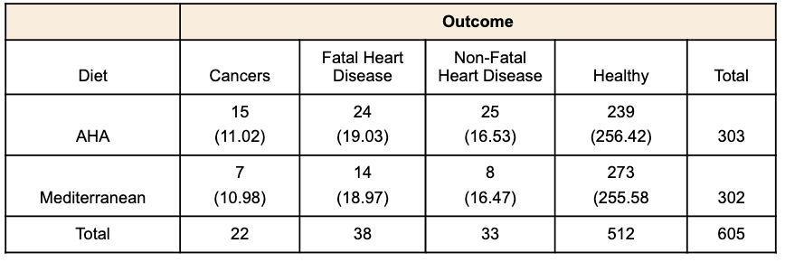
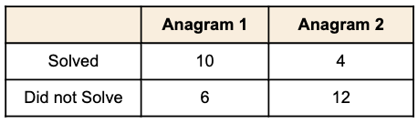
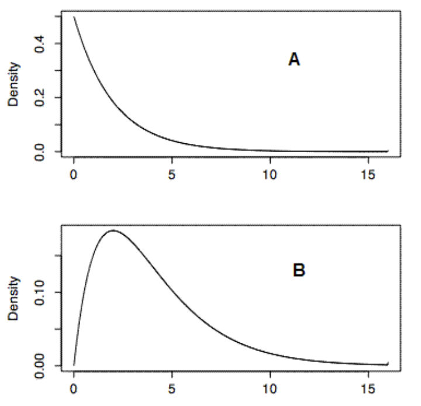

# ۱۷. خی دو

 *الف) توزیع خی-دو*
 *ب) جدول یک طرفه*
 *ج) جدول پیشایندی*
 *د) تمرینات*

خی-دو یک توزیعی است که ثابت شده در آمار بسیار پراستفاده است. اولین بخش راجب مقدمات این توزیع توضیح می دهد. دو بخش بعدی نیز آزمون های آماری را معرفی می کند که از توزیع خی-دو استفداه می کند. بخش --جدول یک طرفه-- نشان می دهد که چطور می توانیم از توزیع خی-دو که تفاوت بین مقادیر مورد انتظار در تئوری را با مقادیر مشاهده شده را آزمون کنیم. بخش --جدول پیشایندی-- نیز نشان می دهد که چطور از توزیع خی-دو برای رابطه بین دو متغیر عددی را آزمون کنیم. این استفاده از خی-دو بسیار پراستفاده است که به آزمون خی-دو معروف شده است.

## توزیع خی-دو

*پیش نیازها*
- فصل ۱: توزیع ها
- فصل ۷: توزیع نرمال استاندارد
- فصل ۱۰: درجه آزادی

*هدف های یادگیری*
1. تعریف توزیع خی-دو به وسیله توان دوم انحراف معیار نرمال
2. توضیخ اینکه چطور شکل توزیع خی-دو تغییر می کند تا افزایش درجه آزادی

انحراف نرمال استاندارد یک نمونه تصادفی از توزیع نرمال استاندارد است. توزیع خی-دو، توزیع جمع توان دوم انحراف نرمال استاندارد است. درجه آزادی این توزیع با جمع تعداد انحرافات نرمال استاندارد برابر است. به همین دلیل، خی-دو با یک درجه آزادی، $\chi^2(1)$ ، به طور ساده همان توزیع یک انحراف نرمال استاندارد به توان دو است. مساحت توزیع خی-دو زیر ۴ برابر است با مساحت توزیع نرمال استاندارد زیر ۲ است، از آنجایی که 4 برابر است با $2^2$.
		سوال بعدی را در نظر بگیرید: شما دو مقدار از توزیع نرمال استاندارد نمونه می گیرید، هر مقدار را به توان دو می رسانیم، و توان دو ها را جمع می کنیم. احتمال اینکه حمع این دو توان دو ها ۶ یا بالاتر باشد چقدر است؟ از آنجایی که دو مقدار نمونه گرفتیم، جواب می تواند با استفاده از توزیع خی-دو با دو درجه آزادی پیدا شود. ماشین حساب خی-دو می تواند استفاده شود برای پیدا کردن احتمال خی-دو (با ۲ درجه آزادی) ۶ یا بالاتر از آن باشد برابر است با 0.050.
	میانگین توزیع خی-دو همان درجه آزادی آن است. توزیع های خی-دو چولگی مثبت دارند، با کم شدن درجه چولگی، درجه آزادی بیشتر می شود. با افزایش درجه آزادی، توزیع خی-دو به سمت توزیع نرمال می رود، شکل۱ نشان دهنده تابع چگالی برای سه توزیع خی-دو می باشد. توجه کنید که چولگی کاهش می یابد همانطور که درجه آزادی افزایش پیدا می کند.

شکل۱. توزیع خی-دو با درجه های آزادی ۲،۴و۶.

 

توزیع خی-دو مهم است به دلیل اینکه خیلی از آزمون های آماری تقریبا مثل خی-دو توزیع دارند. دو تا از مورد استفاده ترین آزمون ها با استفاده از توزیع خی-دو آزمون انحراف معیار از تفاوت بین مقدار مورد انتظار تئوری و مقادیر مشاهده شده است (جدول یک طرفه) و رابطه بین متغیر رسته ای (جدول پیشایندی) است. بسیاری از آزمون های دیگر بر اساس توزیع خی-دو هستند که در این کتاب جایی ندارند.

## جدول یک طرفه (آزمون نیکویی برازش)

*پیش نیازها*
- فصل ۵: موضوعات ساده احتمال
- فصل ۱۱: معنی داری آزمون
- فصل ۱۷: توزیع خی-دو

*هدف های یادگیری*
1. توضیح اینکه مقادیر مورد انتظار (تئوری) به چه معناست
2. محاسبه مقادیر مورد انتظار
3. محاسبه خی-دو
4. مشخص کردن درجه آزادی

توزیع خی-دو استفاده می شود برای آزمون کردن اینکه داده مشاهده شده فرق معناداری با مقادیر تئوری (مورد انتظار) دارد. برای مثال، برای یک تاس شش وجه سالم، احتمال برای هر خروجی از یک پرتاب برابر است با ۱/۶. داده ها در جدول ۱ از پرتاب یک تاس شش وجه، ۳۶ مرتبه می باشد. با اینحال، همانطوری که در جدول ۱ می توان دید، بعضی خروجی ها فراوانی بیشتری از بقیه دارند. برای مثال، '3' به تعداد نه بار دیده شد، ولی '4' فقط دو بار مشاهده شد. آیا این داده ها با فرضی که این یک تاس سالم است دخالت نمی کند؟ به طور طبیعی، ما انتظار نداریم که فراوانی های نمونه برای شش وجه ممکن یکسان باشند از آنجایی که تفاوت شانس های به وجود می آید. پس، فهمیدن اینکه فراوانی ها متفاوت هستند به معنای سالم نبودن تاس نیست. یک روش اینکه آزمون کنیم که یک تاس سالم است یا خیر با اجرای آزمون معنی داری است. فرض صفر این است که تاس سالم است. این فرض با محاسبه احتمال گرفته شده از فراوانی ها بر اساس پراکندگی یا پراکندگی از توزیع یکنواخت از فراوانی های گرفته شده از نمونه آزمون می شود.
اگر این احتمال بسیار کم باشد. سپس فرض صفری که می گویید تاس سالم است می تواند رد شود.

جدول۱. مقادیر فراوانی از یک تاس شش وجه.

 
 

اولین قدم برای اجرای آزمون معناداری محاسبه فراوانی های مورد انتظار برای هر نتیجه با در نظر گرفتن اینکه فرض صفر درست باشد است. برای مثال، فراوانی مورد انتظار برای عدد '1' برابر است با ۶، با توجه به اینکه احتمال آمدن '1' برابر است با 1/6 و ما ۳۶ پرتاب تاس داشتیم.

$$Expected \space Frequency = (1/6)(36) = 6$$

در نظر داشته باشید که فراوانی مورد انتظار، فقط به صورت تئوری مورد انتظار هستند. ما واقعا انتظاری نداریم که فراوانی مشاهده شده دقیقا برابر "فراوانی مورد انتظار" باشد.
	محاسبه به صورت زیر ادامه پیدا می کند. E را می گذاریم که فراوانی مورد انتظار برای نتیجه و O را برای فراوانی مشاهده شده نتیجه در نظر می گیریم. حساب کنید:

$$\frac{(E-O)^2}{(E)}$$

برای هر نتیجه پرتاب تاس. جدول۲ این محاسبات را نشان می دهد.

*جدول۲. نتیجه فراوانی پرتاب یک تاس ۶ وجه* 

 

در مرحله بعد ما تمام مقادیر ستون ۴ جدول ۲ را جمع می کنیم.

$$\sum\frac{(E-O)^2}{E} = 5.33$$

این توزیع نمونه از 

$$\sum\frac{(E-O)^2}{E} $$

تقریبا مانند توزیع خی-دو با k-1 درجه آزادی است، جایی که k برابر تعداد رسته ها است. به همین دلیل، برای این مسئله آماره آزمون برابر است با:

$$\chi_{5}^2$$

که به معنای مقدار خی-دو با ۵ درجه آزادی برابر است با ۵.۳۳۳.
	از ماشین حساب خی-دو می شود نتیجه گرفت که احتمال خی-دو ۵.۳۳۳ یا بزرگتر برابر است با ۰.۳۷۷. به همین دلیل، فرض صفر که می گوید تاس سالم است نمی تواند رد شود.
		آزمون خی-دو میتواند برای آزمون کردن فاصله هایی که بین فراوانی مورد انتظار و فراوانی مشاهده شده وجود دارد استفاده شود. مثال بعدی نشان دهنده این است که متغیر "معدل دانشگاه" در آزمون SAT و معدل دانشگاه توزیع نرمال پیروی میکند.
		اولین ستون در جدول۳ نشان دهنده توزیع نرمال است که به ۵ قسمت تقسیم شده. ستون دوم نشان دهنده نسبت توزیع نرمال در قسمت های مشخص شده در ستون اول است. مقدار فراوانی مورد انتظار (E) با محاسبه ضرب تعداد مقادیر (۱۰۵) با نسبت آنهاست. آخرین ستون نشان دهنده این  تعداد مقادیر مشاهده شده برای هر بازه است. واضح است که مقادیر فراوانی مشاهده شده بسیار تفاوت زیادی با فراوانی مورد انتظار دارد. توجه کنید که اگر توزیع ها نرمال بودند، پس فقط ۳۵ مقدار بین ۰ و ۱ وجود داشت، همچنان که ۶۰ مشاهده داشتیم.

جدول۳. مقادیر مورد انتظار و مشاهده شده برای ۱۰۵ معدل دانشگاه

 

برای آزمون اینکه آیا مقادیر مشاهده شده با فاصله معناداری از مقادیر مورد انتظار هستند، فرمول پایین محاسبه می شود.

$$\chi_3^2 = \sum\frac{(E-O)^2}{E} = 30.09$$

زیرنویس "3" به معنای این است که سه درجه آزادی وجود دارد، مانند قبل، درجه آزادی تعداد نتیجه ها از پرتاب است منهای یک، که در این مثال ۳ است. ماشین حساب توزیع خی-دو نشان دهنده این است که $p < 0.001$ برای این خی-دو. با اینحال، فرض صفر که می گویید مقادیر به از توزیع نرمال پیروی می کنند، می تواند رد شود.

## جداول پیشایندی

*پیش نیازها*
- فصل ۱۷: توزیع خی-دو
- فصل ۱۷: جداول یک طرفه

*هدف های یادگیری*
1. نشان دادن فرض صفر برای آزمون کردن جداول پیشایندی
2. محاسبه فراوانی های موردانتظار هر سلول
3. محاسبه خی-دو و درجه آزادی

این بخش نشان می دهد که چطور از خی-دو برای آزمون کردن معنی داری رابطه بین متغیرهای عددی استفاده می کنیم. برای مثال، جدول۱ نشان دهنده دیتا از تحقیق رژیم مدیترانه ای و سلامتی هست.

جدول۱. فراوانی برای تحقیق رژیم و سلامتی

 

سوال اینکه آیا یک رابطه معنی داری بین رژیم و نتیجه وجود دارد، اولین قدیم محاسبه فراوانی های مورد انتظار برای هر سلول بر اساس فرض اینکه بین آنها هیچ رابطه ای نیست محاسبه می شود. این مقادیر مورد انتظار به این صورت محاسبه می شوند. ما با محاسبه کردن فراوانی مورد انتظار برای ترکیب AHA رژیم/سرطان شروع می کنیم، توجه کنید که 22/605 نفر از افراد سرطان آنها بیشتر شد. نسبتی که سرطان آنها توسعه پیدا کرد پس 0.0364 شد. اگر هیچ رابطه ای بین رژیم و پیامد نبود، پس ما انتظار داشتیم که کسانی که رژیم AHA داشتند 0.0364 به نسبت کل افراد سرطان گرفته بودند. از آنجایی که 303 نفر در رژیم AHA بودند، ما انتظار داشتیم که $(303)(0.0364) = 11.02$ نفر در رژیم AHA سرطان بگیرند. به همین منوال، ما انتظار داشیم که $(302)(0.0364) = 10.98$ سرطان در رژیم مدیترانه ای داشتیم. به طور کلی، فراوانی مورد انتظار برای یک سلول در سطر i ام و ستون j ام برابر بود با :

$$E_{i,j} = \frac{T_iT_j}{T}$$

جایی که $E_{i,j}$ فراوانی مورد انتظار برای سلول i ، j و $T_i$ جمع کل برای ستون i ام بود، $T_j$ جمع کل برای ستون j ام بود و T تعداد کل مشاهدات ما بود. برای رژیم AHA / سرطان ,  $i = 1,j=1, T_i =303,T_j=22$ و $T = 605$ بود. جدول۲ نشان دهنده فراوانی های مورد انتظار (در پرانتز) برای هر سلول در آزمایش ما هست.

جدول۲. فراوانی مشاهده شده و مورد انتظار برای تحقیق رژیم و سلامتی

آزمون معناداری با محاسبه خی-دو اجرا می شود.

$$\chi^2_{3} = \sum\frac{(E-O)^2}{E} = 16.55$$

درجه آزادی برابر است با $(c-1)(r-1)$. جایی که r برابر تعداد سطرها و c برابر تعداد ستون ها است. برای این مثال، درجه آزادی برابر است با   $3 = (2-1)(4-1)$. ماشین حساب خی-دو می تواند در اینجا استفاده شود برای محاسبه مقدار احتمال برای خی-دو ۱۶.۵۵ با سه درجه آزادی برابر است با ۰.۰۰۰۹ . با همین دلیل، فرض صفر اینکه هیج رابطه ای بین رژیم و پیامد آن وجود ندارد می تواند رد شود.
	یک فرضیه کلیدی برای این آزمون خی-دو آن است که هر مورد فقط روی یکی از سلول ها تاثیر می گذارند، به همین دلیل، جمع تمام فراوانی های سلولها در این جدول باید به اندازه تعداد موارد مورد آزمایش ما  باشد. یک آزمایشی را در نظر بگیرید که در آن هر ۱۶ فرد به حل کردن دو مسئله anagram پرداختند. داده های در جدول ۳ نشان داده شده است.

جدول۳. داده های مسئله anagram 

استفاده از آزمون خی-دو برای این داده ها درست نخواهد بود به دلیل اینکه دیتای هر شخص در دو سلول استفاده شده: یک سلول بر اساس عملکرد آنها در مسئله anagram1 و یک سلول بر اساس عملکرد آنها در مسئله anagram2. جمع فراوانی تمام سلول ها در این جدول برابر ۳۲ است، اما جمع تعداد اشخاص فقط ۱۶ نفر است.
	این فرمول برای خی-دو باعث تولید یک آماره می شود که فقط به صورت تقریبی یک توزیع خی-دو است. برای اینکه این تقریب درست باشد، جمع تمام اشخاص باید حداقل ۲۰ باشد، بعضی از نویسنده ها معتقد اند که تصحیح پیوستگی باید زمانی انجام شود که فراوانی مورد انتظار یک فراوانی پایین ۵ باشد. تحقیقات در آمار نشان داده است که این نکته خوبی نیست. برای مثال، Bradley, Bradley, McGrath, & Cutcomb (1979). 
	را ببیند.

تصحیح پیوستگی زمانی که در جداول پیشایندی ۲ در ۲ انجام می شود به تصحیح Yates نامیده می شود.

### سواد آماری:

*پیش نیازها*
- فصل ۱۷: جداول پیشایندی

یک آزمایشی برای آزمون اینکه زعفران باعث جلوگیری از سرطان کبد می شود اجرا شد. بر روی دو گروه از موش ها آزمایش شد. هر دو گروه با مواد شیمیایی که باعث سرطان کبد می شود تزریق شدند. به گروه گروه مورد آزمایش زعفران داده شد (n=24) و به گروه کنترل زعفران داده نشد (n=8). آزمایش [اینجا](https://www.sciencenews.org/view/generic/id/333911/description/Saffron_takes_on_cancer) توضیح داد شده است.

فقط ۴ موش از ۲۴ موش در گروه مورد آزمایش (زعفران خوردند) سرطان گرفتند در مقایسه با ۶ موش از ۸ موشی که در گروه کنترل سرطان گرفتند.

**چه فکر می کنید؟**
از چه روشی می توان استفاده کرد برای آزمون اینکه این تفاوت در بین گروه آزمایش و گروه کنترل به صورت آماری معنادار هستند؟
	از آزمون خی-دو در جداول پیشایندی می توان استفاده کرد. با استفاده از خی-دو (df = 1) و ۹.۵۰ که p_value آن برابر است با ۰.۰۰۲.

منابع:

Bradley, D. R., Bradley, T. D., McGrath, S. G., & Cutcomb, S. D. (1979) Type I error rate of the chi square test of independence in r x c tables that have small expected frequencies. Psychological Bulletin, 86, 1200-1297.

## تمارین

*پیش نیازها*
- تمام مطالب در فصل خی-دو

1. کدام یکی از توزیع های خی-دو (A یا B) درجه آزادی بیشتری دارد؟ چطور فهمیدید؟

2. به دوازده فرد دو طعم بستنی داده شد و از آنها پرسیده شد که آیا آن طعم را دوست داشتند؟ دو فرد طعم اول بستنی را دوست داشتند و نه نفر طعم دو بستنی را دوست داشتند، آیا استفاده از خی-دو برای آزمون *تفاوت در این نسبت ها معنادار است؟* مناسب است؟ چرا یا چرا خیر؟
3. ما مشکوک هستیم که یک تاس ناسالم است. این تاس ۲۵ بار پرتاب شده است به نتایج زیر:
# عکس

یک آزمون معناداری اجرا کنید تا ببینید که آیا این تاس ناسالم است. (a) چه مقدار خی-دو میگیرید و چند درجه آزادی دارد؟ (b) مقدار p_value چقدر است؟

4. یک آزمایش جدیدی در حال آزمایش رابطه بین سیگار کشیدن و بی اختیاری در ادرار را نشان میدهد. از ۳۳۲ موردی که در آزمایش بی اختیاری داشتند، ۱۱۳ نفر سیگار می کشیدند، ۵۱ نفر قبلا سیگار می کشیدند و ۱۵۸ نفر هیچ وقت سیگار نکشیدند، از ۲۸۴ مورد کنترل که بی اختیار نبودند، ۶۸ نفر سیگار می کشیدند، ۲۳ نفر قبلا سیگار می کشیدند و ۱۹۳ نفر هیچ وقت سیگار نکشیدند.
	1. یک جدول برای نمایش این داده ها رسم کنید.
	2. مقدار فراوانی مورد انتظار برای هر سلول چقدر است؟
	3. یک آزمون معنی داری رابطه بین سیگار کشیدن و بی اختیاری اجرا کنید. چه مقدار خی-دو میگیرید؟ چه p_value می گیرید؟
	4. چه نتیجه ای می گیرید؟
5. در یک گردهمایی تشویقی مدرسه، گروهی از دانش‌آموزان سال دوم، یک قرعه‌کشی رایگان برای جوایز ترتیب دادند. آن‌ها ادعا می‌کنند که نام همه دانش‌آموزان مدرسه را در سبد قرار داده‌اند و به طور تصادفی ۳۶ نام را از این سبد بیرون کشیده‌اند. از برندگان جوایز، ۶ نفر سال اول، ۱۴ نفر سال دوم، ۹ نفر سال سوم و ۷ نفر سال آخر بودند. نتایج برای شما آنقدرها هم تصادفی به نظر نمی‌رسد. شما فکر می‌کنید کمی مشکوک است که دانش‌آموزان سال دوم قرعه‌کشی را ترتیب داده‌اند و همچنین بیشترین جوایز را برده‌اند. مدرسه شما از ۳۰٪ دانش‌آموزان سال اول، ۲۵٪ دانش‌آموزان سال دوم، ۲۵٪ دانش‌آموزان سال سوم و ۲۰٪ دانش‌آموزان سال آخر تشکیل شده است.
	1. فراوانی مورد انتظار برای برندگان هر کلاس چقدر است؟
	2. یک آزمون معنی داری برای مشخص کردن اینکه برندگان جایزه در تمام کلاس ها توزیع شده بودند بر اساس درصد مورد انتظار دانش آموزان در هر گروه، خی-دو و p_value خودتان را گزارش دهید.
	3. چه نتیجه ای میگیرید؟
