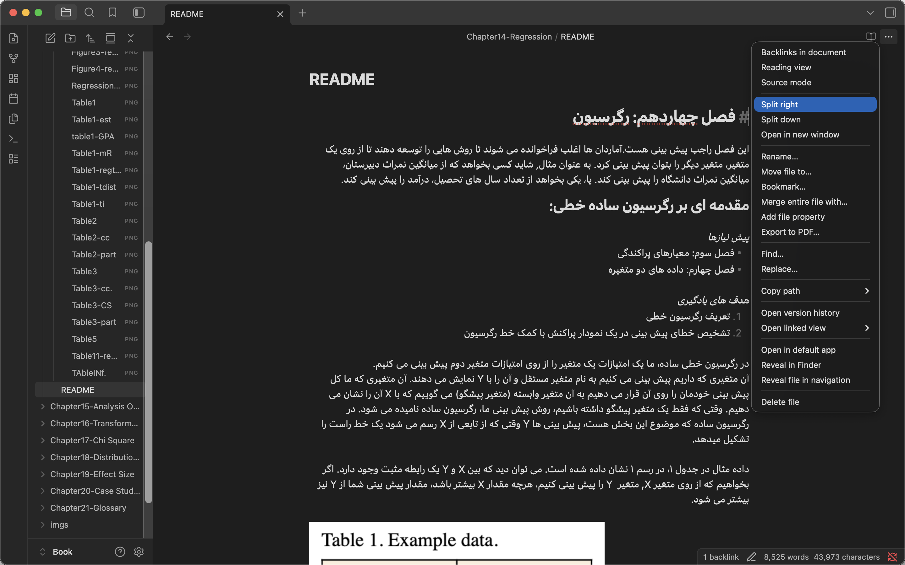
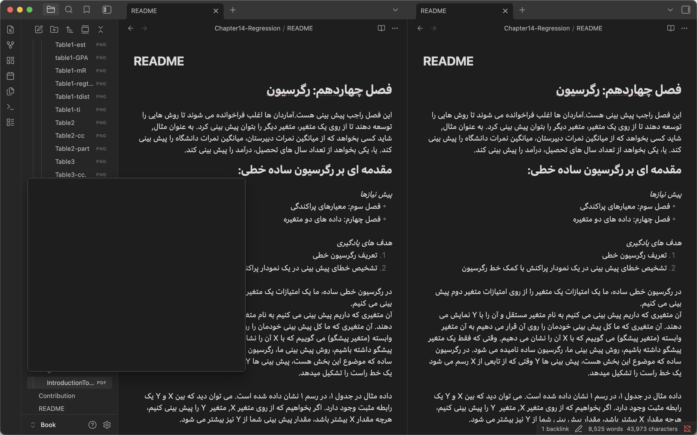
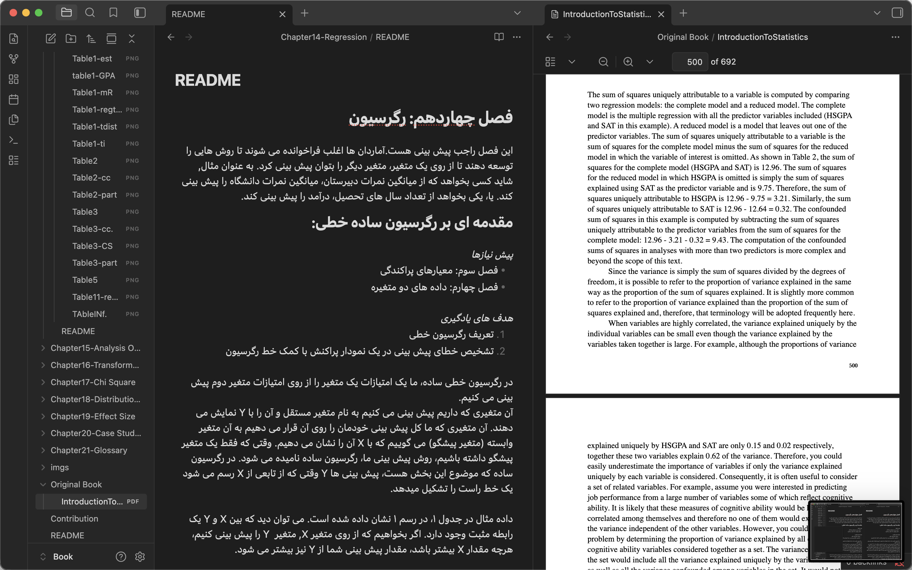

برای اینکه یک قسمت از ترجمه این کتاب را بر عهده بگیرید.

## مرحله اول

اول باید این repo را fork کنید و در پروفایل خودتان قرار دهید و هر جا را که میخواهید را ادیت کنید یا ترجمه کنید.

اگر میخواهید فایل ها را به صورت local داشته باشید می توانید از این دستور در terminal خودتون استفاده کنید.

```
git clone https://github.com/pouniq/ITS_PersianTranslation.git
```

## مرحله دوم

ترجمه ای که برای هر بخش آماده کردید را در README.md مربوط به آن فصل اضافه کنید. 

**نکته:** برای اینکه تصاویر را در README به خوبی نمایش دهید باید تصویر را در فولدر imgs هر بخش قرار دهید و نام گذاری را طبق کتاب پیش ببرید.

### پیشنهاد برای راحت تر شدن ترجمه:

شما میتوانید از Obsidian برای ترجمه استفاده کنید. با ویژگی split view میتوانید، کتاب اصلی را در یک سمت و فایل ترجمه را در سمت دیگر داشته باشید.
به این صورت:




اول از همه روی سه نقطه کلیک کنید و گزینه split right را بزنید.



بعد از آن به پوشه original book بروید و روی فایل pdf کلیک کنید.



و شما در سمت چپ، میتوانید فایل سمت راست را ترجمه کنید.

## مرحله سوم:
ترجمه ای که کردید رو توی repo خودتون push کنید.

## مرحله چهارم:
بعد از اتمام ترجمه pull request بزنید.


