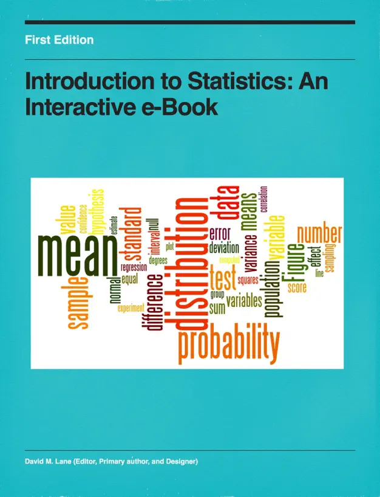

# ترجمه آزاد کتاب Introduction to statistics

کتاب مقدمه ای به آمار، یک کتاب دامنه عمومی است.

شما می توانید در این ترجمه آزاد نیز مشارکت کنید.

برای راهنمایی که چطور می توانید مشارکت کنید به فایل `Contribution.md` بروید.

## فصل ها:

[فصل اول: مقدمه](<Chapter01-Introduction/README.md>)

[فصل دوم: رسم توزیع ها](<./Chapter02-Grpahing Distributions/README.md>)

[فصل سوم: خلاصه کردن توزیع ها](<Chapter03-Summarizing Distributions/README.md>)

[فصل چهارم: توضیح داده های دو متغیره](<Chapter04-Describing Bivariate Data/README.md>)

[فصل پنجم: احتمال](<Chapter05-Probability/README.md>)

[فصل ششم: طراحی تحقیق](<Chapter06-Research Design/README.md>)

[فصل هفتم: توزیع نرمال](<Chapter07-Normal Distribution/README.md>)

[فصل هشتم: نمودارهای پیشرفته](<Chapter08-Advanced Graphs/README.md>)

[فصل نهم: توزیع نمونه ای](<Chapter09-Sampling Distribution/README.md>)

[فصل دهم: برآورد](<Chapter10-Estimation/README.md>)

[فصل یازدهم: منطق آزمون فرض](<Chapter11-Logic of Hypothesis Testing/README.md>)

[فصل دوازدهم: آزمون میانگین ها](<Chapter12-Testing Means/README.md>) 

[فصل سیزدهم: توان](<Chapter13-Power/README.md>)

[فصل چهاردهم: رگرسیون](<Chapter14-Regression/README.md>) (انجام شد.)

[فصل پانزدهم: تحلیل واریانس](<Chapter15-Analysis Of Variance/README.md>)

[فصل شانزدهم: تبدیل ها](<Chapter16-Transformation/README.md>)

[فصل هفدهم: خی-دو](<Chapter17-Chi Square/README.md>)

[فصل هجدهم: آزمون های بدون توزیع](<Chapter18-Distribution-Free Tests/README.md>) 

[فصل نوزدهم: تاثیر اندازه](<Chapter19-Effect Size/README.md>)

